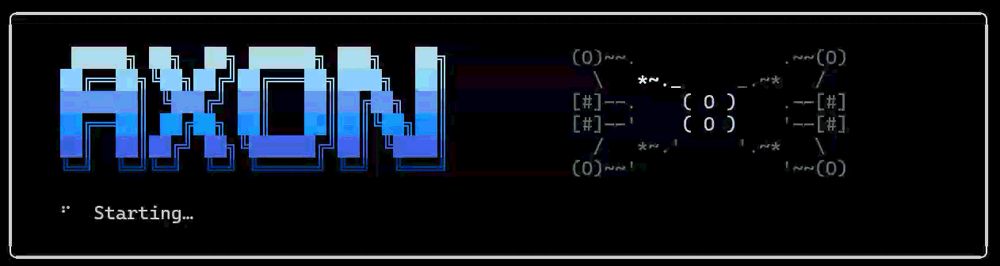

<div align="center">
  

  <h3>Your documents, answerable. On your hardware.</h3>

  <p>
    Drop in PDFs, code, spreadsheets, or URLs — ask anything, get cited answers from a local LLM.<br/>
    Nothing leaves your machine.
  </p>

  [](https://www.python.org/downloads/)
  [](tests/)
  [](LICENSE)
  [](https://github.com/psf/black)

</div>

---

<div align="center">
  
</div>

---

## 🤔 Why Axon?

Most RAG tools make you choose between **cloud power** and **data privacy**. Axon runs entirely on your hardware — full capability, zero egress.

- 🔒 **Private by default** — all inference runs locally via Ollama or vLLM. No API key, no upload, no telemetry.
- 📄 **Ingest anything** — 54 file formats (PDF, DOCX, Jupyter, code, images, URLs) in one command. SHA-256 dedup skips unchanged files.
- 🤖 **Works in your tools** — `@axon` in Copilot Chat, MCP for Claude Code / Codex / Gemini CLI / Cursor, Graph panel in VS Code or your browser.
- 🤝 **Built for teams** — share your knowledge base with signed, revocable read-only keys. Per-user permissions, full audit trail, no extra infrastructure.
- 🕸️ **See your knowledge as a graph** — interactive 3D entity-relationship graph. Embedded webview in VS Code; opens in your browser everywhere else. Click any node to jump to the exact source line.
- 🔬 **Production-grade retrieval** — hybrid search, reranking, HyDE, multi-query expansion, and automatic web fallback. Zero manual tuning.

---

## ✨ Capabilities

<table>
<tr>
<td width="50%" valign="top">

### 🔍 Retrieval
- Hybrid semantic + keyword search
- HyDE, multi-query, step-back, query decomposition
- Sentence-window context retrieval
- BGE reranker for second-pass precision
- Web fallback via Brave Search (CRAG-Lite)
- Smart per-question query routing

</td>
<td width="50%" valign="top">

### 🧠 Graph Intelligence
- **RAPTOR** — hierarchical corpus summaries
- **GraphRAG** — entity/relation/community graph (local / global / hybrid)
- **Code Graph** — file/class/function graph with import edges
- Interactive 3D graph — embedded webview in VS Code, browser elsewhere

</td>
</tr>
<tr>
<td width="50%" valign="top">

### 📥 Ingest Everything
- **54 file formats** — PDF, DOCX, XLSX, PPTX, Jupyter, images, 30+ code formats
- URL ingestion — any public web page
- SHA-256 dedup skips unchanged files
- Stale detection for modified sources
- 5 content-aware chunking strategies

</td>
<td width="50%" valign="top">

### 🔧 LLMs & Embeddings
- **Local:** Ollama, vLLM
- **Cloud:** OpenAI, Gemini, xAI Grok, GitHub Copilot (API)
- Hot-swap provider and model — no restart needed
- Streaming on all providers
- 4 embedding providers; BGE-M3 for multilingual

</td>
</tr>
<tr>
<td width="50%" valign="top">

### 🏗️ Projects & Privacy
- Isolated knowledge base per project, with nesting
- Federated search across projects (`@projects`, `@mounts`, `@store`)
- **Strict offline / air-gapped mode** — zero outbound calls
- **AxonStore** — signed read-only sharing across OS users

</td>
<td width="50%" valign="top">

### 🛡️ Governance & Agents
- **Governance Console** — full audit trail of every query
- Graceful maintenance states: `online → draining → readonly → offline`
- **REST API** — 48 endpoints with Swagger docs at `/docs`
- **MCP server** — 27 tools for Claude Code, Codex, Gemini, Cursor, Copilot
- **`@axon`** VS Code chat participant with Graph and Governance panels

</td>
</tr>
</table>

---

## ⚡ Quick Start

```bash
# 1. Clone and install
git clone https://github.com/jyunming/Axon.git
cd Axon
pip install -e .

# 2. Install Ollama (https://ollama.com) then pull a model
#    (or configure a cloud provider — see docs/MODEL_GUIDE.md)
ollama pull llama3.1:8b

# 3. Start the REPL
axon
```

```
axon> /ingest ./my-docs/
Ingested 142 chunks from 18 files.

axon> /ingest https://docs.example.com/api
Fetched and ingested 23 chunks.

axon> How does the authentication flow work?
The system uses JWT tokens issued at /auth/login...  [source: api-overview.md §3]
```

> **Windows:** Use [Windows Terminal](https://aka.ms/terminal) and set `$env:PYTHONUTF8=1` before running — this tells Python to read files as UTF-8, which prevents encoding errors on documents with non-ASCII characters.
> **Full setup (extensions, MCP, cloud providers):** [docs/SETUP.md](docs/SETUP.md)

---

## 🚀 Entry Points

| Command | Starts | Default Port | Best For |
|---------|--------|-------------|---------|
| `axon` | Interactive REPL | — | Day-to-day exploration, power users |
| `axon-api` | FastAPI REST server | `8000` | Agents, scripts, CI pipelines |
| `axon-mcp` | MCP stdio server | — | Any MCP-compatible agent (Claude Code, Codex, Gemini CLI, Cursor, Copilot…) |
| `axon-ui` | Streamlit UI | `8501` | Browser-based exploration |

---

## 🔌 VS Code + GitHub Copilot

<div align="center">
  
</div>

<div align="center">
  
</div>

<br/>

Install the bundled VSIX to unlock the **`@axon` chat participant**, **Knowledge Graph panel**, **Code Graph panel**, and **Governance dashboard** — directly inside VS Code alongside Copilot.

```
Extensions panel  →  "..."  →  Install from VSIX...
→  integrations/vscode-axon/axon-copilot-0.9.0.vsix
```

Or connect via MCP for Copilot agent mode — point `.vscode/mcp.json` at `axon-mcp` and all 27 tools appear in the agent hammer menu automatically.

**[Full setup guide →](docs/SETUP.md)**

---

## 📚 Documentation

**Getting started**

| | Guide | What it covers |
|-|-------|---------------|
| 🚀 | **[Getting Started](docs/GETTING_STARTED.md)** | First-time walkthrough — ingest, query, settings |
| ⚙️ | **[Setup Guide](docs/SETUP.md)** | Install, models, VS Code extension, MCP connection |
| 🔧 | **[Troubleshooting](docs/TROUBLESHOOTING.md)** | Common errors and platform-specific fixes |

**Reference**

| | Guide | What it covers |
|-|-------|---------------|
| 🔑 | **[Admin Reference](docs/ADMIN_REFERENCE.md)** | Every endpoint, REPL command, CLI flag, and config option |
| ⚡ | **[Quick Reference](docs/QUICKREF.md)** | Commands and flags at a glance |
| 📡 | **[API Reference](docs/API_REFERENCE.md)** | Full REST endpoint reference with request/response schemas |
| 🔌 | **[MCP Tools](docs/MCP_TOOLS.md)** | All 27 MCP tool signatures with parameter defaults |

**Deep dives**

| | Guide | What it covers |
|-|-------|---------------|
| 🤖 | **[Model Guide](docs/MODEL_GUIDE.md)** | Choosing LLM and embeddings; per-provider config examples |
| 🔬 | **[Advanced RAG](docs/ADVANCED_RAG.md)** | HyDE, RAPTOR, GraphRAG, CRAG-Lite — how each technique works |
| 🌐 | **[Web Search](docs/WEB_SEARCH.md)** | Brave Search integration, CRAG-Lite fallback setup |
| 🏝️ | **[Offline / Air-gap Guide](docs/OFFLINE_GUIDE.md)** | Full air-gap setup, model pre-download, local-assets-only mode |
| 💻 | **[Code RAG Guide](docs/CODE_RAG_GUIDE.md)** | Code graph retrieval and structural search |
| 🤝 | **[AxonStore](docs/AXON_STORE.md)** | Multi-user sharing, revocation, and the lease lifecycle |
| 📊 | **[Governance Console](docs/GOVERNANCE_CONSOLE.md)** | Audit trail, maintenance runbook, session management |
| 📈 | **[Evaluation Guide](docs/EVALUATION.md)** | RAGAS metrics, running evals, building testsets |
| 🛠️ | **[Development Guide](docs/DEVELOPMENT.md)** | Tests, contributing, pre-commit hooks |

---

## 🔒 Security

Ingestion is sandboxed to a configurable base directory (`RAG_INGEST_BASE`). Requests outside it are rejected with `403`. See [SECURITY.md](SECURITY.md).

## 📄 License

MIT — see [LICENSE](LICENSE).
