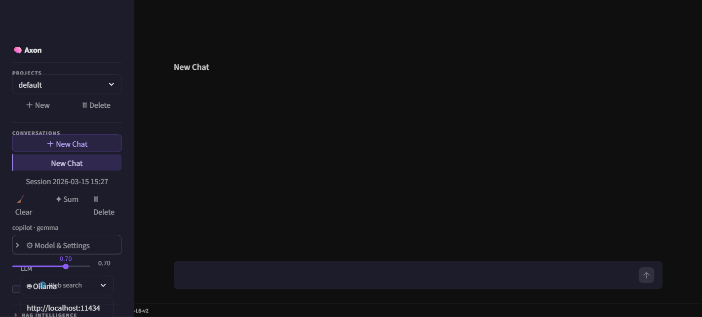

# Axon

<p align="center">
  
</p>

<p align="center">
  <a href="https://www.python.org/downloads/"></a>
  <a href="LICENSE"></a>
  <a href="https://github.com/psf/black"></a>
</p>

**A local-first RAG platform for humans and AI agents.**

Point Axon at your documents. Ask questions. Get answers — using a local LLM with no cloud, no API keys required.

---

## How it works


---

## Install

```bash
# From source (recommended for development)
git clone https://github.com/jyunming/Axon.git
cd Axon
pip install -e .

# Or install as a standalone CLI tool via pipx (no venv management needed)
pipx install git+https://github.com/jyunming/Axon.git
```

Pull a local model (or bring your own API key for Gemini / OpenAI):

```bash
ollama pull llama3.1:8b   # recommended — 4.7 GB, ~8 GB RAM
ollama pull phi3:mini     # minimal — 2.3 GB, ~4 GB RAM
```

> **Windows:** Use [Windows Terminal](https://aka.ms/terminal) and set `$env:PYTHONUTF8=1` in your PowerShell profile.

---

## Launch

| Command | Entry Point | Best For |
|---|---|---|
| `axon` | Interactive REPL | Day-to-day exploration |
| `axon-ui` | Streamlit Web UI | Visual interface at [localhost:8501](http://localhost:8501) |
| `axon-api` | FastAPI REST API | Agents, scripts, Copilot |
| `axon-mcp` | MCP Server | GitHub Copilot agent mode |

---

## GitHub Copilot Integration

There are two ways to connect Axon to GitHub Copilot — pick one or use both:

### Option A — VS Code Extension (Copilot Chat tools)

The VSIX ships with the repo — no download needed:

```
1. Extensions panel (Ctrl+Shift+X) → "..." → Install from VSIX...
2. Select:  integrations/vscode-axon/axon-copilot-1.0.0.vsix
3. Reload VS Code  (Ctrl+Shift+P → "Reload Window")
```

Start `axon-api`, then ask Copilot in chat:

```
Search my knowledge base for information about the authentication module.
Ingest my project docs at /path/to/docs
```

### Option B — MCP Server (Copilot agent mode)

Create `.vscode/mcp.json` in your workspace:

```json
{
  "servers": {
    "axon": {
      "type": "stdio",
      "command": "axon-mcp",
      "env": { "RAG_API_BASE": "http://localhost:8000" }
    }
  }
}
```

Create `.vscode/settings.json`:
```json
{ "chat.mcp.access": "all" }
```

Start `axon-api`, reload VS Code — Axon tools appear in Copilot agent mode (hammer icon).

> See **[Getting Started](GETTING_STARTED.md)** for full setup details, workflow diagrams, and per-entry-point examples.


---

## Interactive REPL


---

## Web UI



---

## Key capabilities

- **Hybrid search** — dense vector + BM25 keyword, fused for better precision than either alone
- **Multi-LLM** — Ollama (local), Gemini, OpenAI, vLLM; switch live from the REPL
- **Multi-embedding** — sentence-transformers, Ollama, FastEmbed
- **Vector stores** — ChromaDB (default), Qdrant, LanceDB
- **Rich document support** — PDF, DOCX, HTML, CSV/TSV, Markdown, JSON, plain text, images (BMP/PNG/TIF/PGM with VLM auto-captioning)
- **Project namespaces** — isolated knowledge bases per named project; nested projects search children automatically
- **Query transformations** — HyDE, multi-query, step-back, decomposition, contextual compression
- **Advanced indexing** — RAPTOR hierarchical summaries, GraphRAG entity graph
- **Reranking** — cross-encoder (BGE) reranking
- **Agent-ready** — FastAPI REST API + MCP server for Copilot agent mode

---

## Guides

| Guide | What it covers |
|---|---|
| **[Getting Started](GETTING_STARTED.md)** | Ingest/query workflow for every entry point — with diagrams |
| **[Setup Guide](SETUP.md)** | Full install for all platforms, models, VS Code extension config, MCP |
| **[Quick Reference](QUICKREF.md)** | All CLI flags, REPL commands, API endpoints |
| **[Model Guide](MODEL_GUIDE.md)** | Choosing an LLM and embedding model |
| **[Troubleshooting](TROUBLESHOOTING.md)** | Common errors and fixes |
| **[Development Guide](DEVELOPMENT.md)** | Running tests, contributing |
| **[SOTA Gaps](SOTA_ANALYSIS.md)** | What's not yet implemented and why |

---

## Security

File ingestion is restricted to a configurable base directory (`RAG_INGEST_BASE`, defaults to the current working directory). Requests outside this directory are rejected with 403. See [SECURITY.md](SECURITY.md) for details.

---

## License

MIT — see [LICENSE](LICENSE).
