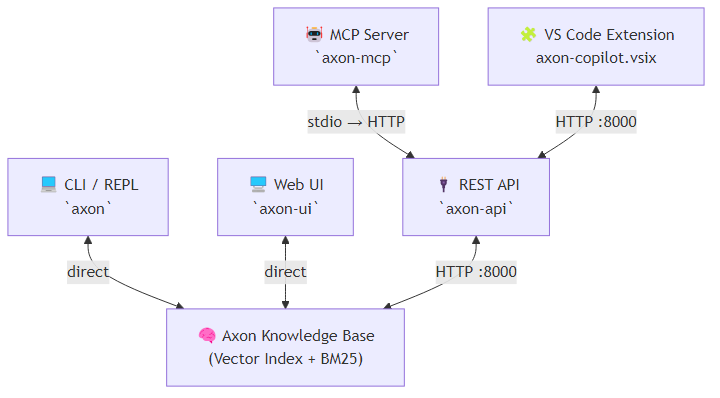
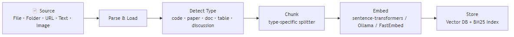
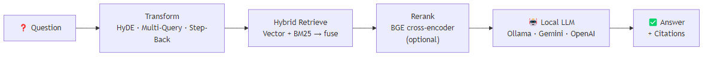
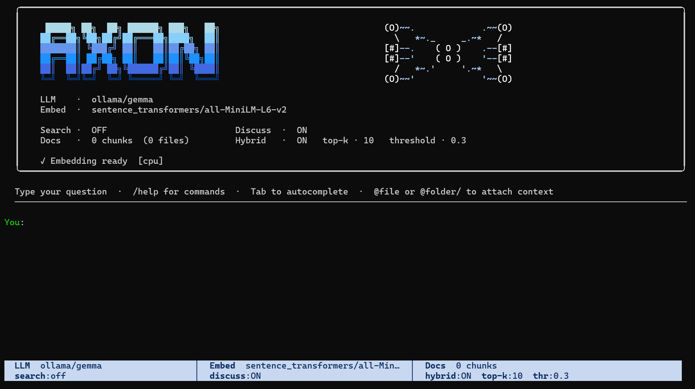
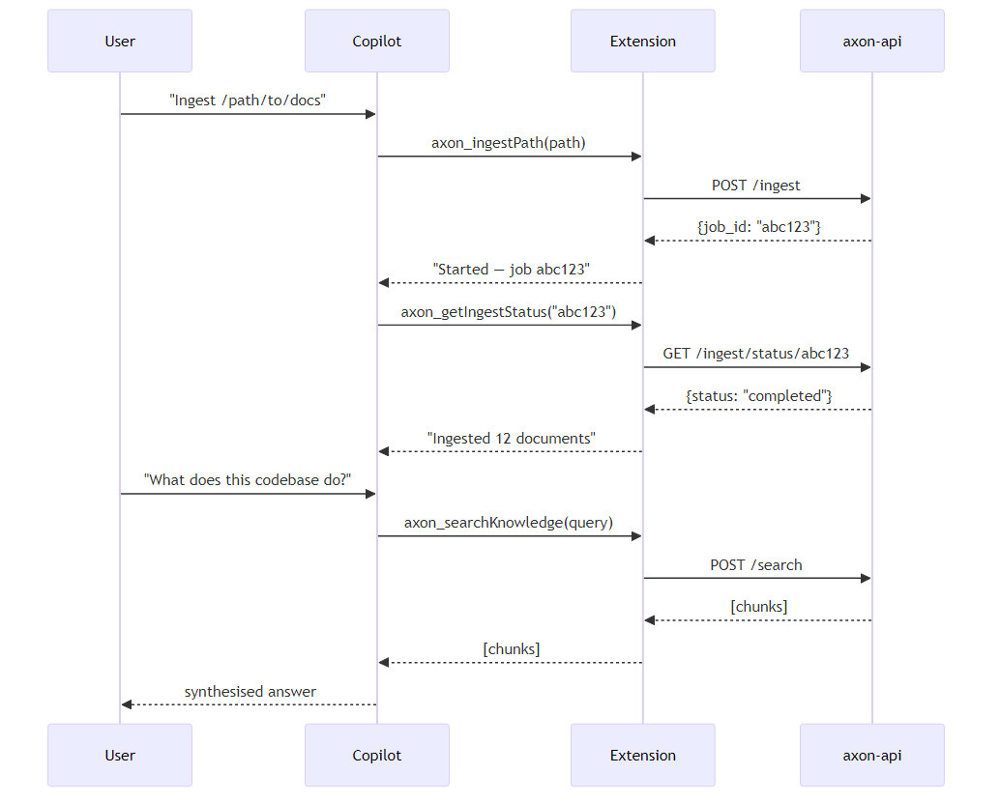
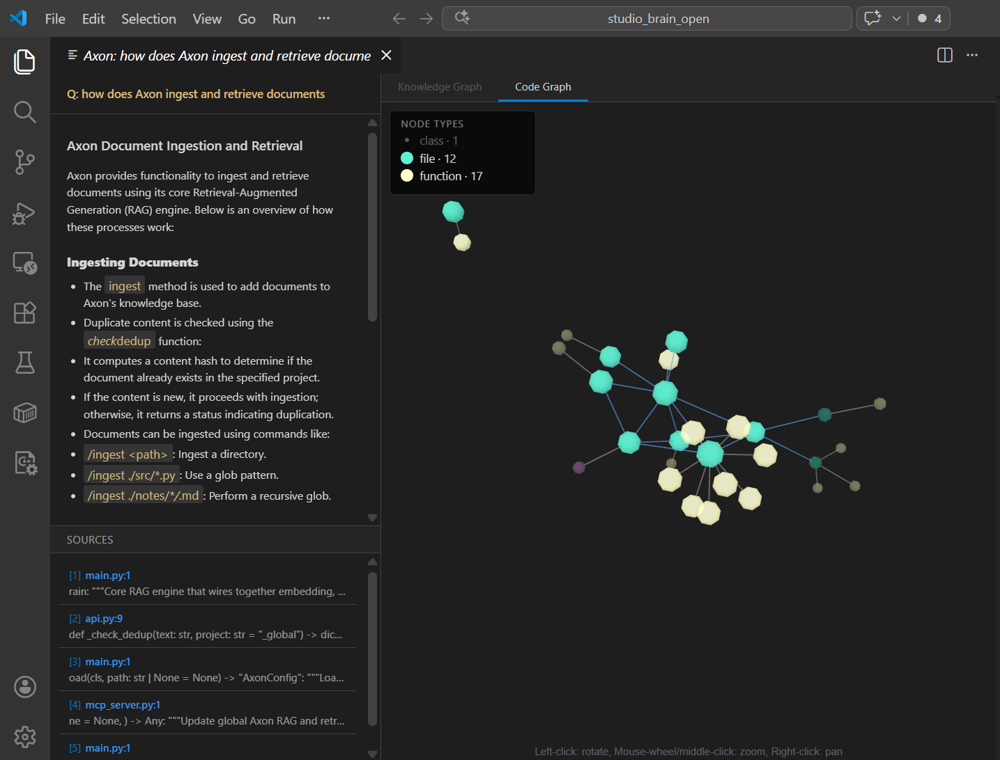
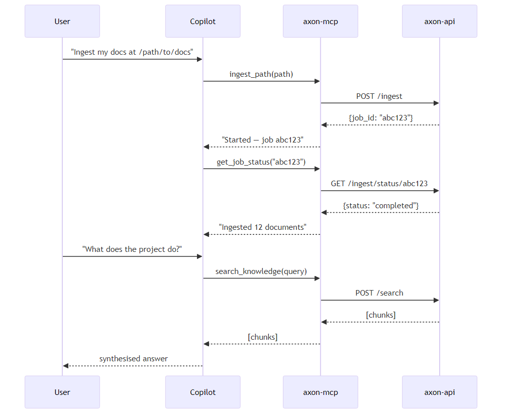
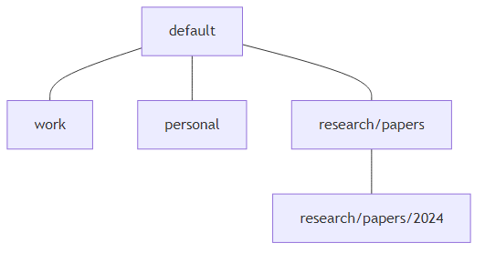

# Getting Started with Axon


Axon has five different ways to use it — terminal chat, VS Code extension, REST API, browser UI, and MCP for AI coding agents — and they all share the same knowledge base. Ingest once, query from anywhere.


> **What is "ingesting"?** Ingesting means reading your files and turning them into a searchable index. Axon splits each document into small chunks, converts each chunk into a numeric representation (a vector), and stores them so it can quickly find the most relevant pieces when you ask a question.





---


## Quick Install


> **Before you start:** Make sure you have [Python 3.10 or later](https://www.python.org/downloads/) installed. Run `python --version` to check.


```bash

# 1. Download the code

git clone https://github.com/jyunming/Axon.git

cd Axon


# 2. Install Axon  (-e means "editable" — you can update the code without reinstalling)

pip install -e .

```


> You should see `Successfully installed axon-...` at the end. If you see errors, check that your Python version is 3.10+ with `python --version`.


> **Tip:** It is good practice to use a virtual environment so Axon's packages don't conflict with other Python projects. See [SETUP.md § 2](SETUP.md#2-install-the-package) for step-by-step instructions.


```bash

# 3. Install Ollama — the free app that runs LLMs on your computer

#    Download from: https://ollama.com  (install it, then come back here)

#    Then pull a model (pick one):

ollama pull llama3.1:8b   # recommended — good quality, needs ~8 GB RAM

ollama pull phi3:mini     # lighter option — needs ~4 GB RAM

```


> **Verify Ollama is running** before continuing. Open a new terminal and run:

> ```bash

> curl http://localhost:11434

> ```

> You should see `Ollama is running`. If you get "connection refused", Ollama hasn't started yet — open the Ollama app from your Applications/Start menu, or run `ollama serve` in a terminal and leave it running.


---


## Where Your Data Lives


Axon uses two locations in your home folder:


| What | Linux / macOS | Windows |

|---|---|---|

| **Config file** | `~/.config/axon/config.yaml` | `C:\Users\<you>\.config\axon\config.yaml` |

| **Knowledge base data** | `~/.axon/AxonStore/<username>/` | `C:\Users\<you>\.axon\AxonStore\<username>\` |


Each project gets its own subfolder under your user directory (e.g. `~/.axon/AxonStore/<username>/default/`). **Back up the `AxonStore/` folder** to preserve your knowledge base, or set `AXON_STORE_BASE` to point to a different disk or network share.


**Rough disk estimates:**


| What | Approximate size |

|---|---|

| 100-page PDF | 5–10 MB in the vector store |

| 1,000 code files | 50–100 MB |

| Embedding model (`all-MiniLM-L6-v2`) | ~90 MB |

| LLM via Ollama (`llama3.1:8b`) | ~4.7 GB |


---


## How Ingestion Works


When you run `/ingest ./my-docs/`, Axon:

1. Reads every supported file in the folder

2. Splits each file into small overlapping text chunks (~500 words each)

3. Converts each chunk into a vector (a list of numbers that captures the meaning of the text)

4. Saves the vectors in a local database — nothing is sent anywhere





## How Querying Works


When you ask a question, Axon:

1. Converts your question into a vector the same way it processed your documents

2. Finds the stored chunks whose vectors are most similar to your question (the most relevant pieces)

3. Sends those chunks plus your question to the LLM

4. The LLM reads the relevant chunks and writes an answer with citations pointing back to your files





---


## Entry Point 1 — REPL (interactive chat in the terminal)


The REPL is a chat interface that runs in your terminal. Type a question and press Enter.




**Launch:**

```bash

axon

```


You should see the `axon>` prompt. That means Axon is ready. If you get an error on your first query, Ollama is most likely not running — see [TROUBLESHOOTING.md](TROUBLESHOOTING.md).


**Ingest your documents first:**

```

axon> /ingest ./my-documents/       ← ingest everything in a folder

axon> /ingest ./report.pdf          ← ingest a single file

axon> /ingest https://example.com   ← ingest a web page

```


You'll see a confirmation like `Ingested 142 chunks from 18 files.`


**Then ask questions:**

```

axon> What are the main topics in these documents?

axon> Summarise the Q3 report

axon> Explain this code @./src/main.py

```


> **`@./src/main.py`** — putting `@` before a file path attaches that file's contents to your question inline. You can also use `@./folder/` to attach a whole folder.


**Useful commands:**


| Command | What it does |

|---|---|

| `/ingest <path>` | Ingest a file, folder, or URL |

| `/list` | Show all ingested documents with chunk counts |

| `/model <name>` | Switch LLM on the fly (e.g. `llama3.1:8b`, `gemini-1.5-flash`, `gpt-4o`) |

| `/project switch <name>` | Change to a different knowledge base |

| `/rag topk 10` | Retrieve the top 10 most relevant chunks per query (default is 10) |

| `/rag rerank` | Toggle reranking — a second pass that re-scores retrieved chunks to improve relevance |

| `/rag hyde` | Toggle HyDE — generates a hypothetical ideal answer first, then searches for similar text (helps with vague questions) |

| `/llm temperature 0.2` | Set how creative the LLM is: `0.0` = focused and consistent, `2.0` = creative but unpredictable |

| `/sessions` | Browse saved conversation history |

| `/context` | Show current model, RAG settings, and how much of the context window is used (the context window is the maximum amount of text the LLM can hold in memory at once) |

| `/search` | Toggle live web search (requires a Brave API key — see [WEB_SEARCH.md](WEB_SEARCH.md)) |

| `/clear` | Clear the current conversation history (does **not** delete your ingested documents) |

| `/help` | Full list of all commands |


---


## Entry Point 2 — VS Code Extension (`@axon` in Copilot Chat)


> **Important:** `axon-api` must be running in a **separate terminal** before you use the extension. Start it with `axon-api` and leave that terminal open.


The VS Code extension adds an `@axon` chat participant, a live Knowledge Graph panel, and a Code Graph panel directly inside VS Code alongside GitHub Copilot.


**Install:**


Open VS Code → Extensions panel (`Ctrl+Shift+X`) → click `···` (top-right of the panel) → **Install from VSIX** → select the file `integrations/vscode-axon/axon-copilot-0.9.0.vsix` from the Axon folder → reload VS Code.


> **What is a VSIX file?** It is the file format for VS Code extensions — like an installer package specific to VS Code.


**How the extension finds Python** (needed for `autoStart` — which means the extension can start `axon-api` automatically when you open VS Code):


| Your install method | What to do |

|---|---|

| `pip install` into a virtual environment | Run `axon` once from the terminal — the path is saved automatically |

| `pipx install axon` | Nothing — the extension finds pipx automatically |

| Workspace virtual environment (`.venv/` folder) | Nothing — the extension checks your open folder automatically |

| Custom path | Set `axon.pythonPath` in VS Code Settings (`Ctrl+,`, search "axon") |


After installing the VSIX and starting `axon-api`, open Copilot Chat (`Ctrl+Shift+I`) and use natural language:







**Ingest documents:**

```

@axon ingest my documents at /path/to/docs

@axon add this URL to my knowledge base: https://docs.example.com

```


**Ask questions:**

```

@axon search for information about the login flow

@axon what does the authentication module do?

```


**Manage projects:**

```

@axon list all my projects

@axon switch to the "work" project

@axon what files have I ingested?

```


**Ingest an image** (requires a vision-capable model like GPT-4o, Claude, or LLaVA):

```

@axon describe and ingest this diagram: /path/to/architecture.png

```


**Open the Graph panel:**

```

Command Palette (Ctrl+Shift+P) → Axon: Show Graph for Query…

Command Palette → Axon: Show Graph for Selection   ← with text selected in the editor

```


> Full setup guide including Python discovery, settings, and troubleshooting: [SETUP.md § 11](SETUP.md#11-vs-code-extension-github-copilot-integration)


---


## Entry Point 3 — REST API (for scripts and integrations)


The API lets your own programs, scripts, and automation tools talk to Axon over HTTP.


**Launch** (run this in a **separate terminal** and leave it running):

```bash

axon-api   # starts at http://localhost:8000

```


You should see `Uvicorn running on http://0.0.0.0:8000`. Leave this terminal open — closing it stops the API.


**Easiest way to explore:** open `http://localhost:8000/docs` in your browser — this shows every endpoint with a form to try it interactively. No code needed.


> **What is `curl`?** It is a command-line tool for making HTTP requests — like clicking a button in a browser, but scriptable. If you prefer a visual interface, use the Swagger UI at `/docs` instead.


> **Getting a `403 Forbidden` error when ingesting?** Axon only allows reading files from within a configured base directory (`RAG_INGEST_BASE`). If you get a 403, check the `RAG_INGEST_BASE` value in your `.env` file and make sure it covers the folder you are trying to ingest from. By default it is set to your home directory.


**Ingest a folder (returns immediately, runs in the background):**

```bash

curl -X POST http://localhost:8000/ingest \

  -H "Content-Type: application/json" \

  -d '{"path": "/path/to/docs"}'

# ← returns a job_id straight away; ingest runs in the background


# Check if it finished (replace abc123 with your job_id)

curl http://localhost:8000/ingest/status/abc123

# ← keeps returning {"status": "processing"} until done, then {"status": "completed"}

```


**Ingest a single piece of text:**

```bash

curl -X POST http://localhost:8000/add_text \

  -H "Content-Type: application/json" \

  -d '{"text": "Important note to remember.", "metadata": {"source": "notes"}}'

```


**Ask a question (returns a full synthesised answer):**

```bash

curl -X POST http://localhost:8000/query \

  -H "Content-Type: application/json" \

  -d '{"query": "What are the main topics?"}'

```


**Search without an LLM answer (returns raw matching chunks):**

```bash

curl -X POST http://localhost:8000/search \

  -H "Content-Type: application/json" \

  -d '{"query": "authentication flow", "top_k": 5}'

```


---


## Entry Point 4 — Browser UI


A visual chat interface. No terminal commands needed after launch.


**Launch:**

```bash

axon-ui   # opens automatically at http://localhost:8501

```


Open `http://localhost:8501` in your browser if it doesn't open automatically.


**Ingest:**

- Left sidebar → **Knowledge Hub** → paste a URL, type a file path, or upload a file directly


**Query:**

- Type in the chat input at the bottom → press Enter


**Settings:**

- Left sidebar → **Model & Settings** → toggle hybrid search, reranking, HyDE, RAPTOR, and GraphRAG. Leave these off for now — they are advanced search techniques explained in the [RAPTOR + GraphRAG](#raptor--graphrag--getting-the-most-out-of-axon) section below.


---


## Entry Point 5 — MCP Server (for AI coding agents)


> **What is MCP?** Model Context Protocol is an open standard that lets AI coding agents call external tools programmatically. This is different from the VS Code extension (Entry Point 2): the extension gives you an `@axon` chat participant inside Copilot Chat; the MCP server gives any MCP-compatible agent direct access to all 27 Axon tools without a chat interface.


`axon-mcp` is a standard stdio server built on the open MCP protocol. It works with **Claude Code, OpenAI Codex CLI, Google Gemini CLI, Cursor, VS Code Copilot agent mode**, and any other MCP-compatible tool.





**Supported clients — quick config reference:**


| Tool | Config file | Notes |

|---|---|---|

| **Claude Code** | `~/.claude/settings.json` | `claude mcp add axon axon-mcp --env RAG_API_BASE=http://localhost:8000` |

| **OpenAI Codex CLI** | `~/.codex/config.toml` | TOML format — see SETUP.md |

| **Google Gemini CLI** | `~/.gemini/settings.json` | Same JSON shape as Claude Code |

| **VS Code** (agent mode) | `.vscode/mcp.json` | Also needs `.vscode/settings.json` |

| **Cursor** | `.cursor/mcp.json` | Same JSON shape as Claude Code |


The JSON config is the same for Claude Code, Gemini CLI, VS Code, and Cursor — only the file path differs:


```json

{

  "mcpServers": {

    "axon": {

      "command": "axon-mcp",

      "env": { "RAG_API_BASE": "http://localhost:8000" }

    }

  }

}

```


> `RAG_API_BASE` tells the MCP server where `axon-api` is running.


**VS Code also needs** `.vscode/settings.json`:

```json

{ "chat.mcp.access": "all" }

```


**To activate:** start `axon-api`, then reload your editor. Axon's tools appear in the agent panel automatically.


> Full setup for all platforms (Windows PATH, Linux venv, WSL, shared team): [SETUP.md § 10](SETUP.md#10-mcp-server-setup)


---


## Projects — Multiple Knowledge Bases


Each project has its own separate, isolated knowledge base. This lets you keep work documents, personal notes, and code repos separate from each other. Parent projects automatically search their child projects too.





```bash

# REPL — create and switch projects

/project new work                  # create a project called "work"

/project new research/papers       # create a nested project (research → papers)

/project switch work               # switch to "work"

/project list                      # show all projects


# CLI — single query against a specific project

axon --project work "Summarise the Q3 report"

axon --project research "What papers discuss attention mechanisms?"


# API

curl -X POST http://localhost:8000/query \

  -H "Content-Type: application/json" \

  -d '{"query": "What are the main topics?", "project": "work"}'

```


### Search across all projects at once


These special scope names let you query multiple projects in one go. They are read-only — you cannot ingest while in a merged scope.


| Command | What it searches |

|---|---|

| `/project @store` | Your default project + all local projects + all mounted shares |

| `/project @projects` | All local projects only |

| `/project @mounts` | Only projects shared with you by others (mounted via AxonStore) |

| `/project myproject` | Switch back to a specific writable project |


---


## RAPTOR + GraphRAG — Getting the Most Out of Axon


Both features are **off by default** to keep your first ingest fast. Enable them once your documents are indexed and you want richer answers to complex questions.


> **What are RAPTOR and GraphRAG?**

> - **RAPTOR** — after ingesting, it generates summary notes that group related chunks together. Helps with big-picture questions that no single paragraph can answer on its own.

> - **GraphRAG** — extracts named entities (people, places, concepts) and the relationships between them from your documents, then builds a graph. When you ask a question it can follow the connections to find related information you might otherwise miss.


> **What is an "LLM call"?** One request sent to the language model (Ollama, OpenAI, etc.). More calls means longer ingest time but usually better answer quality.


### When should you enable these?


| Your corpus size | Recommendation |

|---|---|

| Fewer than 50 documents | Skip both — basic retrieval works well at this scale |

| 50–5,000 documents | Start with `graph_rag_depth: light` — no extra ingest time, enables the interactive graph |

| 5,000+ documents, or complex multi-topic content | Enable `graph_rag_depth: standard` and RAPTOR for the best answer quality on broad questions |


### Feature comparison


| Feature | What it adds | Extra ingest time |

|---|---|---|

| **RAPTOR** | Groups ~5 related chunks into a summary chunk. Good for long documents and multi-page questions | ~1 LLM call per 5 chunks |

| **GraphRAG (light)** | Extracts noun phrases and maps how often they co-occur. Zero LLM calls. Enables the interactive graph | **None** |

| **GraphRAG (standard)** | Adds LLM-written entity descriptions and relationship triples (e.g. "Alice **works at** Acme Corp"). Richer, better at connecting dots | ~1–3 LLM calls per chunk |

| **RAPTOR + GraphRAG** | Combined — RAPTOR summaries feed into GraphRAG, cutting total LLM calls by ~50–80% | Less than running each separately |


### Start with: free graph (no extra LLM calls)


> **Prerequisite:** Graph features require extra libraries. Install them once:

> ```bash

> pip install "axon[graphrag]"

> ```

> The quotes are required on most terminals.


Edit `~/.config/axon/config.yaml` (Linux/macOS) or `C:\Users\<you>\.config\axon\config.yaml` (Windows):


```yaml

rag:

  graph_rag: true

  graph_rag_depth: light      # uses text patterns only — no LLM calls

  graph_rag_relations: false  # turn off relationship extraction (LLM-heavy)

  graph_rag_community: false  # turn off community detection

```


### Upgrade to a richer graph


```yaml

rag:

  graph_rag_depth: standard   # LLM writes a description for each extracted entity

  graph_rag_relations: true   # also extracts relationships between entities

```


### Reduce ingest time


**Skip RAPTOR for large files:**

```yaml

rag:

  raptor_max_source_size_mb: 2.0   # skip RAPTOR for any source file larger than 2 MB

```


**Turn both off during a big initial ingest, then turn on for daily use:**

```yaml

rag:

  raptor: false

  graph_rag: false

```


---


### Visualize the graph


The interactive 3D graph works everywhere — how it opens depends on which tool you're using:


| Where you are | How the graph opens |

|---|---|

| **VS Code extension** | Embedded webview panel — no browser tab needed |

| **REPL, API, MCP, or any other tool** | Opens in your default browser automatically |


**VS Code — Graph Panel:**


```

Command Palette (Ctrl+Shift+P) → Axon: Show Graph for Query…

```


Or select text in the editor, then `Axon: Show Graph for Selection`. The panel opens as a split-view alongside your answer:


```

┌──────────────────────┬──────────────────────────────────────┐

│  Q: How does         │  [ Knowledge Graph ]  [ Code Graph ] │

│     retrieval work?  │                                      │

│  ────────────────    │   ●─────────────◆                    │

│  LLM answer with     │      3D force-graph                  │

│  inline citations    │   ▼              ▼                   │

│  ────────────────    │   ●              ●                   │

│  [1] retrievers.py ▸ │                                      │

│  [2] main.py:142  ▸  │   click any node → jump to source   │

└──────────────────────┴──────────────────────────────────────┘

```


Clicking any citation or graph node opens the source file at the exact line in the editor.


**REPL — opens in browser:**


```

/graph viz              # opens the live graph in your default browser

/graph-viz              # export to a temp HTML file and print the path

/graph-viz /out.html    # export to a specific file

```


**API — opens in browser or save to file:**


```bash

curl http://localhost:8000/graph/visualize -o graph.html


# Then open it:

open graph.html        # macOS

xdg-open graph.html   # Linux

start graph.html       # Windows

```


| Tab | What it shows | How to enable |

|---|---|---|

| **Knowledge Graph** | Entity–relation graph from your documents | Set `graph_rag: true` in `config.yaml` |

| **Code Graph** | File/class/function graph with import edges | Set `code_graph: true` in `config.yaml` |


---


## Fully local / offline setup


To run Axon with no internet at all, or to enforce that all model files are pre-downloaded, see the **[Offline / Air-Gap Guide](OFFLINE_GUIDE.md)**.


---


## Where to go next


| Guide | What it covers |

|---|---|

| [SETUP.md](SETUP.md) | Full install, all model options, VS Code extension config, MCP setup |

| [QUICKREF.md](QUICKREF.md) | All REPL commands, CLI flags, and API endpoints at a glance |

| [MODEL_GUIDE.md](MODEL_GUIDE.md) | Choosing an LLM and embedding model for your hardware |

| [ADVANCED_RAG.md](ADVANCED_RAG.md) | Deep dive into HyDE, RAPTOR, GraphRAG, CRAG-Lite — how each technique works |

| [WEB_SEARCH.md](WEB_SEARCH.md) | Enabling Brave Search fallback when your knowledge base doesn't have the answer |

| [CODE_RAG_GUIDE.md](CODE_RAG_GUIDE.md) | Code graph retrieval — querying your codebase structurally |

| [AXON_STORE.md](AXON_STORE.md) | Sharing your knowledge base with teammates using AxonStore |

| [GOVERNANCE_CONSOLE.md](GOVERNANCE_CONSOLE.md) | Audit trail, maintenance states, session management |

| [OFFLINE_GUIDE.md](OFFLINE_GUIDE.md) | Running with no internet / pre-downloaded models |

| [TROUBLESHOOTING.md](TROUBLESHOOTING.md) | Common errors and fixes |

