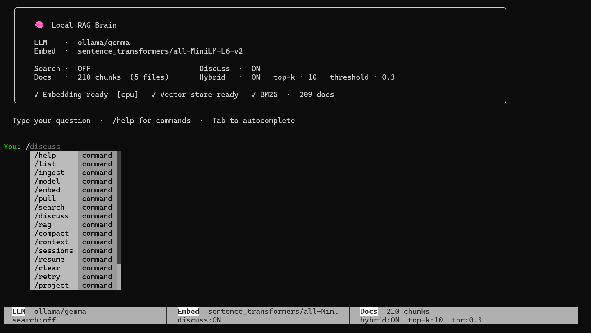
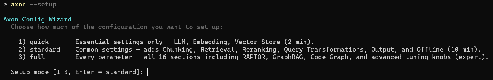
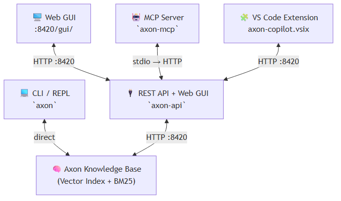

# Getting Started

From `pip install` to a cited answer about your own files. You need **Python 3.10 or
later**, a folder of documents, and — only for the answer step — either
[Ollama](https://ollama.com) or a cloud API key. Indexing needs neither.



---

## 1. Install

```bash
python -m venv .venv
source .venv/bin/activate          # Windows: .venv\Scripts\activate
pip install "axon-rag[starter]"
```

`[starter]` adds sealed (encrypted) sharing and the EPUB / RTF / Outlook loaders; the
browser GUI, REST API and MCP server are in every install. The quotes stop your shell from
treating the brackets as a pattern.

Check the machine:

```bash
axon --doctor
```

Two checks must pass — the Python version and a writable store. The others are advice:
if you haven't installed Ollama yet, *Ollama reachable* and *LLM model pulled* show `!`;
that's expected until step 3, and irrelevant if you'll use a cloud key.

## 2. Index a folder

```bash
axon --ingest ./my-notes
```

Point it at any folder or file — Markdown, text, PDF, Word, PowerPoint, Excel, CSV,
notebooks, HTML, email and 24 source-code extensions are all read
([the full list](REFERENCE.md#111-formats)). Three things happen the first time:

- **The embedding model downloads** (about 90 MB, once) into
  `~/.axon/model_cache/fastembed`. It runs locally with ONNX — no PyTorch.
- **The config file is created** at `~/.config/axon/config.yaml` with the shipped defaults.
- **Your files are chunked, embedded and indexed** into the `default` project. The
  default configuration makes **no LLM calls** while indexing: the LLM-heavy features
  (RAPTOR summaries, GraphRAG entity extraction) are off until you turn them on.

When indexing finishes, Axon opens its interactive prompt. Type `/list` to see what was
indexed and `/quit` to leave. From the shell, `axon --list` shows the same (here for a
two-file folder):

```
  Knowledge Base — 2 file(s), 2 chunk(s)
```

Run the same `--ingest` again after editing files: unchanged content is skipped
(`axon --refresh` re-indexes only files that changed).

## 3. Ask a question

Answers need a language model. Pick one.

### Option A — local, with Ollama

Install Ollama from [ollama.com/download](https://ollama.com/download) and make sure it is
running (the app, or `ollama serve`). Then just ask:

```bash
axon "What do my notes say about the release plan?"
```

The default model is `llama3.1:8b` (needs about 8 GB of RAM). If Ollama doesn't have it
yet, Axon pulls it first — about 4.7 GB, with progress printed — and then answers. To
download it ahead of time: `ollama pull llama3.1:8b`. On a smaller machine try
`ollama pull phi3:mini` and add `--model phi3:mini`.

### Option B — a cloud model

Set the key for your provider and name a model; the model name picks the provider:

```bash
export GEMINI_API_KEY=...            # PowerShell: $env:GEMINI_API_KEY = "..."
axon --model gemini-2.5-flash "What do my notes say about the release plan?"

export OPENAI_API_KEY=...
axon --model gpt-4o-mini "What do my notes say about the release plan?"
```

Use any model your key can access. Only the question and the retrieved passages are sent
to the provider; your index stays on your machine. xAI Grok, vLLM, any OpenAI-compatible
local server and GitHub Copilot work too — see [providers](REFERENCE.md#51-providers).

### What you get back

An answer grounded in your files, with inline citations such as `[Document 1]` pointing at
the passages it used. If nothing relevant was found, Axon says so and answers from general
knowledge, labelled as such — turn that off with `/discuss` in the REPL or
`discussion_fallback: false` in the config.

### Make your choice stick

`--model` lasts for one command. To save a provider and model, run the wizard:

```bash
axon --setup
```



*quick* asks only for the provider, model and embeddings. You can also edit
`~/.config/axon/config.yaml` directly ([every setting](REFERENCE.md#3-configuration)), or
store cloud keys from inside the REPL with `/keys set gemini` (saved to `~/.axon/.env`).

## 4. Use the REPL

`axon` on its own opens an interactive prompt. Type questions; commands start with `/`.

| Command | Does |
|---|---|
| `/ingest ./path` | Index a file, folder or glob (`./src/*.py`) |
| `/list` | What's indexed |
| `/model gpt-4o-mini` | Switch the LLM for this session |
| `/rag` | Show retrieval settings; `/rag rerank`, `/rag hyde`, … toggle them |
| `/project new work` | Create and switch to a separate knowledge base |
| `/project switch default` | Back to the default one |
| `/sessions`, `/resume <id>` | Earlier conversations |
| `/context` | Model, settings and what the last answer used |
| `/help` | Everything else |
| `/quit` | Leave |

Put `@path/to/file` in a question to attach a file to that one question without indexing
it: `Explain this @./src/main.py`.

## 5. Where things live

| What | Where |
|---|---|
| Configuration | `~/.config/axon/config.yaml` |
| Your knowledge bases | `~/.axon/AxonStore/<your-username>/` — one folder per project |
| Embedding model cache | `~/.axon/model_cache/fastembed/` |
| API keys saved by `/keys set` | `~/.axon/.env` |
| CLI logs | `~/.axon/logs/` |

On Windows `~` is `C:\Users\<you>`. Back up `~/.axon/AxonStore/` to keep your data, or
move it with `axon --store-init /other/disk` (or `AXON_STORE_BASE`).

---

## Other ways in

Everything shares the same knowledge base, so index once and use it from anywhere.



**Browser.** Start the server and open the web GUI — chat, a files view, the graph explorer
and settings:

```bash
axon-api                     # http://localhost:8420/gui/  ·  API docs at /docs
```

**VS Code.** `axon-ext` installs the bundled extension: `@axon` in Copilot Chat, 20
Copilot tools and a 3D graph panel. It starts `axon-api` for you on Linux and macOS; on
Windows start `axon-api` yourself. [More](REFERENCE.md#10-vs-code-extension).

**AI coding agents (MCP).** With `axon-api` running:

```bash
claude mcp add axon axon-mcp --env RAG_API_BASE=http://localhost:8420
```

Claude Desktop, Codex, Gemini CLI, Cursor and VS Code agent mode take the same server —
[configs for each](REFERENCE.md#91-connecting-a-client). Agents get 18 tools to search,
ingest, manage projects, tune settings, write graph facts and share; destructive and
store-administration operations stay with you.

**Scripts.** With `axon-api` running:

```bash
curl -X POST http://localhost:8420/query -H "Content-Type: application/json" \
  -d '{"query": "What do my notes say about the release plan?"}'
```

The response carries the answer plus `sources` and `citations` arrays
([REST reference](REFERENCE.md#8-rest-api)). From Python, `AxonBrain` and the LangChain /
LlamaIndex retrievers work in-process ([Python](REFERENCE.md#19-python-library)).

---

## Next steps

- **Separate knowledge bases** for work, research and code:
  [projects and scopes](REFERENCE.md#16-projects-scopes-and-sessions).
- **Better answers** on hard questions — reranking, HyDE, multi-query and friends:
  [retrieval features](REFERENCE.md#12-retrieval-features). Entity graphs and summaries for
  large corpora: [knowledge graphs](REFERENCE.md#13-knowledge-graphs). Source code:
  [code retrieval](REFERENCE.md#14-code-retrieval).
- **Share a knowledge base**, including through OneDrive, Dropbox or Google Drive with
  encryption: [Sharing](SHARING.md).
- **No internet at all:** [offline and air-gapped operation](REFERENCE.md#17-offline-and-air-gapped-operation).
- **Something wrong?** [Troubleshooting](TROUBLESHOOTING.md) — start with `axon --doctor`.
