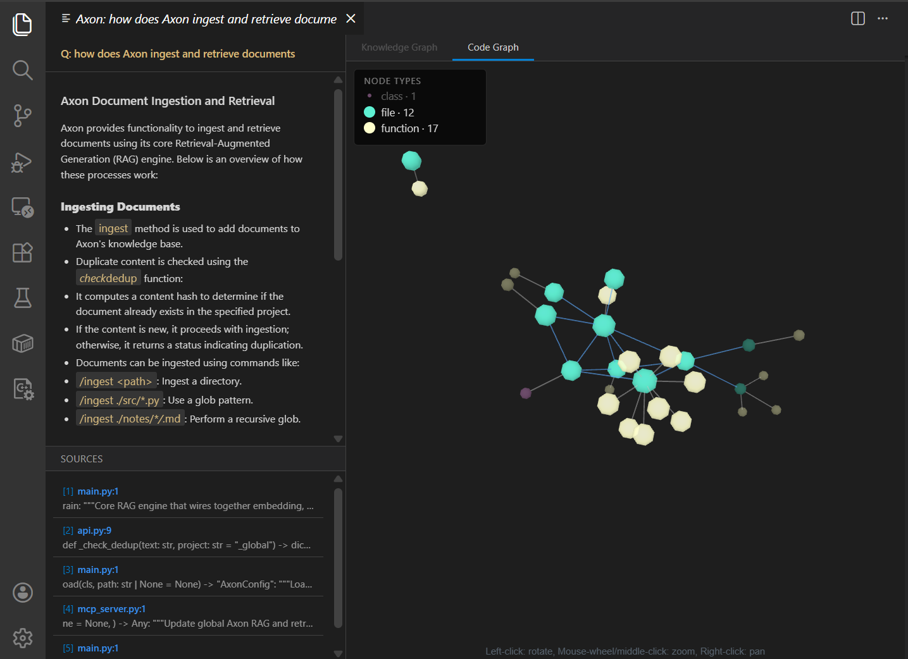

# Axon Reference

Everything Axon can do, on every surface, in one place. New to Axon? Start with
[Getting Started](GETTING_STARTED.md) — it gets you from `pip install` to a cited answer.
Sharing a knowledge base with someone else is covered in [Sharing](SHARING.md); error
messages and fixes are in [Troubleshooting](TROUBLESHOOTING.md).

Every command, flag, key and route below was checked against the source of the release
this file ships with. Counts are recounted, not copied: **9 LLM providers, 18 install
extras, 162 config fields, 69 REST routes, 18 MCP tools, 20 VS Code LM tools and
19 VS Code commands.**

## Contents

1. [Installation and extras](#1-installation-and-extras)
2. [Entry points and the API server](#2-entry-points-and-the-api-server)
3. [Configuration](#3-configuration)
4. [Environment variables](#4-environment-variables)
5. [LLM providers and embeddings](#5-llm-providers-and-embeddings)
6. [CLI (`axon`)](#6-cli-axon)
7. [REPL commands](#7-repl-commands)
8. [REST API](#8-rest-api)
9. [MCP server (`axon-mcp`)](#9-mcp-server-axon-mcp)
10. [VS Code extension](#10-vs-code-extension)
11. [Ingestion](#11-ingestion)
12. [Retrieval features](#12-retrieval-features)
13. [Knowledge graphs](#13-knowledge-graphs)
14. [Code retrieval](#14-code-retrieval)
15. [Web search](#15-web-search)
16. [Projects, scopes and sessions](#16-projects-scopes-and-sessions)
17. [Offline and air-gapped operation](#17-offline-and-air-gapped-operation)
18. [Operations](#18-operations)
19. [Python library](#19-python-library)

---

## 1. Installation and extras

Axon needs **Python 3.10 or later**. The package is `axon-rag` on PyPI; the commands it
installs are `axon`, `axon-api`, `axon-mcp` and `axon-ext`.

```bash
python -m venv .venv
source .venv/bin/activate            # Windows: .venv\Scripts\activate
pip install "axon-rag[starter]"      # recommended: sealed sharing + extra loaders
pip install axon-rag                 # the bare engine
```

The quotes matter on most shells (square brackets are glob characters). From a clone,
`pip install -e ".[dev]"` gives an editable install with the test tools — see
[CONTRIBUTING.md](../CONTRIBUTING.md).

The base install already contains everything a default configuration uses: the FastEmbed
embedder (ONNX, no PyTorch), TurboQuantDB (`tqdb`) as the vector store, BM25, the Ollama,
OpenAI and Gemini clients, the REST server and web GUI, the MCP server, the document
loaders for the common formats, and `prometheus-client` for `/metrics`.

### Extras

| Extra | Adds | When you need it |
|---|---|---|
| `starter` | `cryptography`, `keyring`, `ebooklib`, `striprtf`, `extract-msg` | Recommended first install: sealed sharing plus EPUB / RTF / Outlook `.msg` loaders |
| `sealed` | `cryptography`, `keyring` | Sealed (encrypted) projects and shares, without the loaders |
| `loaders` | `ebooklib`, `striprtf`, `extract-msg` | EPUB, RTF and `.msg` ingestion |
| `sentence-transformers` | `sentence-transformers`, `tf-keras` (pulls PyTorch) | `embedding.provider: sentence_transformers`, or the cross-encoder reranker (`rerank.enabled: true` with `rerank.provider: cross-encoder`) |
| `lancedb` | `lancedb` | `vector_store.provider: lancedb` |
| `chroma` | `chromadb` | `vector_store.provider: chroma` |
| `qdrant` | `qdrant-client` | `vector_store.provider: qdrant` |
| `fastembed` | `fastembed` | No-op since 0.4.6 (FastEmbed is in the base install); kept so old install lines still resolve |
| `graphrag` | `networkx`, `leidenalg`, `igraph` | GraphRAG community detection (`graph_rag_community`) and the Leiden backend |
| `gliner` | `gliner` | `graph_rag_ner_backend: gliner` — entity extraction without LLM calls |
| `rebel` | `transformers`, `torch` | `graph_rag_relation_backend: rebel` — relation extraction without LLM calls |
| `llmlingua` | `llmlingua` | `context_compression.strategy: llmlingua` and `graph_rag_report_compress` |
| `langchain` | `langchain-core` | `axon.integrations.langchain.AxonRetriever` |
| `llama-index` | `llama-index-core` | `axon.integrations.llama_index.AxonLlamaRetriever` |
| `eval` | `deepeval` | The DeepEval integration tests |
| `dev` | pytest, black 23.12.1, ruff, mypy, pre-commit, and the optional backends | Contributing |
| `sealed-test` | `requests` | The WebDAV end-to-end sealed-share tests |
| `all` | Every optional runtime dependency above | Everything except the `dev` / test tooling |

Combine extras with commas: `pip install "axon-rag[starter,graphrag]"`.

### Upgrading

```bash
axon update        # checks PyPI, asks, upgrades the package and the bundled VS Code extension
axon update -y     # no prompt
```

`axon update` detects whether Axon was installed with `pip`, `pipx` or `conda` and runs the
matching upgrade. It refuses to run inside a container (use `docker compose pull && docker
compose up -d`) and while an `axon-api` server is serving the active store (stop it first).
It does not migrate config files — read `CHANGELOG.md` for breaking changes. `axon` and
`axon-api` also check PyPI at most once a day in the background (cached in
`~/.axon/.update_check_cache.json`, skipped when `offline.enabled` is on) and print a
one-line hint when a newer release exists. The REPL equivalent is `/update`.

For an editable install, `git pull && pip install -e .` instead — `axon update` upgrades a
published package, not a checkout.

**Changing the embedding model** changes vector dimensions; re-ingest (or start a new
project) afterwards.

---

## 2. Entry points and the API server

| Command | Starts | Default port | Use it for |
|---|---|---|---|
| `axon` | Interactive REPL, or one-shot CLI commands | — | Day-to-day use, scripts |
| `axon-api` | FastAPI REST server **and the web GUI** | `8420` | Agents, scripts, the browser UI, VS Code, MCP |
| `axon-mcp` | MCP stdio server (talks to `axon-api`) | — | Claude Code, Codex, Gemini CLI, Cursor, Copilot agent mode |
| `axon-ext` | Installs the bundled VS Code extension (VSIX) | — | One-time VS Code setup |

### axon-api

```bash
axon-api                                  # 0.0.0.0:8420
axon-api --host 127.0.0.1 --port 9000
axon-api --config /path/to/config.yaml
```

- **Port:** `--port` > `AXON_PORT` > `config.yaml`'s `api.port` > `8420`.
- **Bind host:** `--host` > `AXON_HOST` > `0.0.0.0`. `config.yaml`'s `api.host` is *not* a
  bind setting — it tells the CLI/REPL where to look for a running server.
- **Config file:** `--config` > `AXON_CONFIG_PATH` > `~/.config/axon/config.yaml`.
- Interactive API docs: `http://localhost:8420/docs` (Swagger UI) and `/redoc`.
- **Web GUI:** `http://localhost:8420/gui/` — chat, a files view of the knowledge base,
  the graph explorer and settings. No extra install; the Streamlit `axon-ui` was removed in
  0.5.0.

**One server per store.** `axon-api` writes a lock for the store it serves and refuses to
start a second server on the same store (set `AXON_ALLOW_MULTIPLE_SERVERS=1` to override).
Two processes writing one store is how vector-store files get damaged — see
[Troubleshooting](TROUBLESHOOTING.md#turboquantdb-queries-crash-the-process-or-errno-22-invalid-argument-on-ingest).

**Single-instance routing.** When an `axon-api` is already serving your store, the `axon`
CLI detects it (a quick `/health/ready` probe) and routes store-mutating commands —
`--ingest`, `--clear`, project create / delete / switch — and the REPL through that server
instead of opening the store a second time. `--local` forces an in-process brain. The CLI
finds the server through `AXON_API_BASE` (or `RAG_API_BASE`), else `api.host` / `api.port`.

**Authentication.** Off by default. Set `RAG_API_KEY` in the server's environment and every
request must carry a matching `X-API-Key` header; `/health*`, `/metrics`, `/gui/`, `/docs`,
`/redoc`, `/openapi.json`, `/favicon.ico` and `/brand/*` stay open. Clients read the same
variable (`axon-mcp` sends `RAG_API_KEY`; VS Code has `axon.apiKey`). Put a reverse proxy
with TLS in front of any server reachable from other machines.

**CORS.** Off unless `api.allow_origins` lists origins in `config.yaml` (read at startup).

**Ingest sandbox.** `POST /ingest` (and the MCP `ingest_knowledge(path=...)`) only reads
paths under `RAG_INGEST_BASE`, which defaults to the directory `axon-api` was started in.
Anything outside returns `403`.

### Docker

The repository's `docker-compose.yml` runs `axon-api` on port 8420 next to an `ollama`
container (`OLLAMA_HOST=http://ollama:11434`), reading `./config.yaml` and an optional
`.env`. `docker compose up -d` starts both; `docker compose logs -f` follows them.

---

## 3. Configuration

Axon reads one YAML file: `~/.config/axon/config.yaml` (Windows:
`C:\Users\<you>\.config\axon\config.yaml`). The first command that loads it creates it
with the shipped defaults. `axon --config PATH` uses another file for one invocation;
`axon-api` also honours `AXON_CONFIG_PATH`.

```bash
axon --setup              # interactive wizard (quick / standard / full)
axon --config-validate    # unknown keys, bad values, risky combinations; exit 1 on errors
axon --config-reset       # overwrite config.yaml with the shipped defaults
```

In the REPL: `/config`, `/config validate`, `/config wizard`, `/config reset`,
`/config set <key> <value>`. Over REST: `GET /config`, `GET /config/validate`,
`POST /config/set`, `POST /config/update`, `POST /config/reset`. The wizard's
**quick** mode asks about provider, model and embeddings; **standard** covers the main
settings; **full** adds the RAPTOR and GraphRAG sub-settings. Ctrl+C leaves without
saving.

### How the file maps to settings

Every setting is a field of `AxonConfig` (162 of them). The YAML groups them into
sections; most sections prefix or rename their keys, and `rag:` is special:

- `embedding.*`, `llm.*` and `chunk.*` keys become `embedding_*`, `llm_*` and `chunk_*`
  fields (`chunk.size` → `chunk_size`). A few `llm:` keys are renamed
  (`llm.base_url` → `ollama_base_url`, `llm.models_dir` → `ollama_models_dir`).
- **`rag:` takes field names verbatim.** Any field can be set there, including ones with a
  section of their own (`rag: {rerank: true}` works as well as `rerank: {enabled: true}`).
  A misspelt name is flagged by `--config-validate`, never applied.
- `rerank:`, `query_transformations:`, `context_compression:`, `web_search:`, `offline:`,
  `api:`, `security:`, `store:` and `repl:` map as listed in the tables below.
- A few keys are top-level: `max_workers`, `ingest_batch_mode`, `max_chunks_per_source`,
  `source_policy_enabled`, `qdrant_url`, `qdrant_api_key`.

**Precedence:** environment variables that override a setting (section 4) beat
`config.yaml`, which beats the built-in defaults. **The shipped `config.yaml` is not the
same as the built-in defaults:** it turns `raptor`, `graph_rag` and `graph_rag_community`
*off*, while `AxonConfig()` built directly in Python has them *on*. The tables list the
shipped value where they differ.

Keys removed in 0.5.0 (SPLADE's `sparse_*`, and about 80 internal `graph_rag_*` tuning
knobs now fixed in `axon/graph_defaults.py`) still load; Axon logs that they are ignored
and `--config-validate` says why.

### 3.1 llm

| Key | Default | Meaning |
|---|---|---|
| `llm.provider` | `ollama` | `ollama`, `openai`, `gemini`, `grok`, `vllm`, `local`, `ollama_cloud`, `copilot`, `github_copilot` — see [section 5](#5-llm-providers-and-embeddings) |
| `llm.model` | `llama3.1:8b` | Model name as the provider knows it |
| `llm.temperature` | `0.7` | 0.0 (deterministic) – 2.0 |
| `llm.max_tokens` | `8192` | Answer budget. High on purpose: reasoning models spend it on `reasoning_content` before writing the answer |
| `llm.timeout` | `60` (`300` for `local`) | Seconds. A per-read bound, not a wall-clock deadline — a server that keeps streaming keeps resetting it |
| `llm.base_url` | `http://localhost:11434` | Ollama URL (field `ollama_base_url`; `OLLAMA_HOST` wins) |
| `llm.models_dir` | `""` | Ollama model directory (field `ollama_models_dir`; `OLLAMA_MODELS` wins) |
| `llm.openai_api_key` | `""` | OpenAI key (or `OPENAI_API_KEY`) |
| `llm.gemini_api_key` | `""` | Gemini key (or `GEMINI_API_KEY`) |
| `llm.grok_api_key` | `""` | xAI key (or `XAI_API_KEY` / `GROK_API_KEY`) |
| `llm.vllm_base_url` | `http://localhost:8000/v1` | vLLM server (or `VLLM_BASE_URL`) |
| `llm.local_base_url` | `http://localhost:8080/v1` | Any OpenAI-compatible server on this machine (or `AXON_LOCAL_LLM_BASE_URL`) |
| `llm.local_api_key` | `""` | Bearer token for that server, if it wants one (or `LOCAL_LLM_API_KEY`) |
| `llm.ollama_cloud_url` | `https://ollama.com/api` | Remote Ollama endpoint (or `OLLAMA_CLOUD_URL`) |
| `llm.ollama_cloud_key` | `""` | Remote Ollama key (or `OLLAMA_CLOUD_KEY`) |
| `llm.api_key` | `""` | Legacy alias for the OpenAI key |

The GitHub Copilot OAuth token (field `copilot_pat`) comes from `GITHUB_COPILOT_PAT` /
`GITHUB_TOKEN` or the REPL's `/keys set github_copilot`; it has no YAML key.

### 3.2 embedding

| Key | Default | Meaning |
|---|---|---|
| `embedding.provider` | `fastembed` | `fastembed`, `sentence_transformers`, `ollama`, `openai` |
| `embedding.model` | `sentence-transformers/all-MiniLM-L6-v2` | Model id; FastEmbed needs the full catalog id |
| `embedding.model_path` | `""` | Local model folder (sentence-transformers) or cache directory (FastEmbed); wins over `model` |
| `embedding.dim` | `0` | Force the vector dimension (0 = detect from the model) |

### 3.3 vector_store

| Key | Default | Meaning |
|---|---|---|
| `vector_store.provider` | `turboquantdb` | `turboquantdb`, `lancedb`, `chroma`, `qdrant` |
| `vector_store.tqdb_bits` | `4` | Quantisation bits: 2, 4 or 8 |
| `vector_store.tqdb_rerank` | `true` | Exact rerank pass after the ANN search |
| `vector_store.tqdb_rerank_precision` | `null` | `null` (dequantised), `f16` or `f32` (exact, more disk) |
| `vector_store.tqdb_fast_mode` | `false` | Faster queries, slightly lower recall |
| `vector_store.tqdb_ef_construction` | `200` | HNSW build quality |
| `vector_store.tqdb_max_degree` | `32` | HNSW graph degree |
| `vector_store.tqdb_search_list_size` | `128` | Candidate list at query time |
| `vector_store.tqdb_alpha` | `null` | HNSW pruning (null = TQDB default, 1.2) |
| `vector_store.tqdb_n_refinements` | `null` | HNSW refinement passes (null = TQDB default, 5) |
| `vector_store.tqdb_hybrid` | `false` | TQDB-side BM25 + dense fusion |
| `vector_store.tqdb_hybrid_weight` | `0.5` | Dense weight in that fusion |
| `vector_store.qdrant_url` (or top-level `qdrant_url`) | `""` | Qdrant server URL; empty = local file mode |
| `vector_store.qdrant_api_key` (or top-level `qdrant_api_key`) | `""` | Qdrant API key |

Storage paths are always derived from the store (`<store>/AxonStore/<user>/<project>/`);
`vector_store.path` and `bm25.path` in a config file are ignored. TurboQuantDB presets:
`bits: 4` + `rerank: true` is the default balance; `bits: 8` for maximum recall;
`bits: 2` for minimum disk.

### 3.4 Retrieval (rag)

| Key | Default | Meaning |
|---|---|---|
| `rag.top_k` | `10` | Chunks passed to the LLM |
| `rag.similarity_threshold` | `0.3` | Minimum cosine similarity (compared against the dense score, also in hybrid mode) |
| `rag.hybrid_search` | `true` | Dense + BM25 |
| `rag.hybrid_mode` | `rrf` | `rrf` (Reciprocal Rank Fusion) or `weighted` |
| `rag.hybrid_weight` | `0.7` | Dense share in `weighted` mode (1.0 = dense only) |
| `rag.rerank` | `false` | Rerank candidates (same as `rerank.enabled`) |
| `rag.sentence_window` | `false` | Expand hits to surrounding sentences |
| `rag.sentence_window_size` | `3` | Sentences on each side (1–10) |
| `rag.parent_chunk_size` | `1500` | Parent passage size for small-to-big retrieval (0 = off) |
| `rag.mmr` | `false` | Maximal Marginal Relevance de-duplication |
| `rag.mmr_lambda` | `0.5` | 1.0 = pure relevance, 0.0 = pure diversity |
| `rag.cite` | `true` | Ask the LLM for `[Document N]` citations |
| `rag.query_router` | `heuristic` | Per-query strategy router: `heuristic`, `llm`, `off` |
| `rag.query_cache` | `false` | In-memory answer cache (bypassed when chat history is present) |
| `rag.query_cache_size` | `128` | Cached entries |
| `rag.query_cache_ttl` | `1800` | Seconds (0 = never expire) |
| `rag.dedup_on_ingest` | `true` | Skip chunks whose content hash was already ingested |
| `rag.contextual_retrieval` | `false` | Prepend LLM-written context to each chunk at ingest (one LLM call per chunk) |
| `rag.crag_lite` | `false` | Grade retrieval confidence; fall back when low ([12](#crag-lite)) |
| `rag.crag_lite_confidence_threshold` | `0.4` | Below this, CRAG-Lite falls back |
| `rag.truth_grounding` | `false` | Brave web fallback (same as `web_search.enabled`) |

### 3.5 query_transformations

| Key | Default | Meaning |
|---|---|---|
| `query_transformations.hyde` | `false` | Hypothetical-document embedding (1 LLM call) |
| `query_transformations.multi_query` | `false` | Paraphrase the query and merge results (1 LLM call) |
| `query_transformations.step_back` | `false` | Also retrieve for a more abstract version of the query (1 LLM call) |
| `query_transformations.query_decompose` | `false` | Split compound questions into sub-questions (1 LLM call) |
| `query_transformations.discussion_fallback` | `true` | Answer from general knowledge, labelled as such, when nothing relevant is retrieved |
| `rag.unified_query_transforms` | `true` | Produce all enabled transforms in one LLM call instead of one each |

### 3.6 chunk

| Key | Default | Meaning |
|---|---|---|
| `chunk.strategy` | `semantic` | `semantic`, `recursive`, `markdown`, `cosine_semantic` (code files always use the syntax-aware splitter) |
| `chunk.size` | `1000` | Target size in tokens |
| `chunk.overlap` | `200` | Overlap in tokens |
| `rag.cosine_semantic_threshold` | `0.7` | Split point for `cosine_semantic` |
| `rag.cosine_semantic_max_size` | `500` | Maximum chunk size for `cosine_semantic` |
| `rag.max_chunks_per_source` | `0` | Keep only the first N chunks of each source (0 = all) |
| `rag.dataset_type` | `auto` | Force a chunking profile: `auto`, `codebase`, `paper`, `doc`, `discussion`, `knowledge`, `manifest`, `reference` |

`cosine_semantic_*`, `max_chunks_per_source` and `dataset_type` are fields, not `chunk:`
keys — put them under `rag:` (or `max_chunks_per_source` at the top level).

### 3.7 rerank

| Key | Default | Meaning |
|---|---|---|
| `rerank.enabled` | `false` | Rerank retrieved candidates before generation |
| `rerank.provider` | `cross-encoder` | `cross-encoder` (needs the `sentence-transformers` extra) or `llm` |
| `rerank.model` | `cross-encoder/ms-marco-MiniLM-L-6-v2` | Cross-encoder model; `BAAI/bge-reranker-v2-m3` for multilingual |
| `rerank.top_k` | `5` | Results kept after reranking |

### 3.8 Graph (rag)

| Key | Default | Meaning |
|---|---|---|
| `rag.graph_rag` | `false` shipped (`true` built-in) | Build and use the entity graph |
| `rag.graph_rag_depth` | `standard` | `light` (regex, no LLM), `standard` (LLM entity extraction), `deep` (+ claims and canonicalisation) |
| `rag.graph_rag_mode` | `local` | `local` (entities and relations), `global` (community summaries), `hybrid` |
| `rag.graph_rag_budget` | `3` | Graph-expanded chunks added beyond `top_k` (0 = no guaranteed slots) |
| `rag.graph_rag_relations` | `true` | Extract `SUBJECT \| RELATION \| OBJECT` triples |
| `rag.graph_rag_relation_budget` | `30` | Chunks per ingest batch that get relation extraction (0 = all) |
| `rag.graph_rag_min_entities_for_relations` | `3` | Skip relation extraction for sparser chunks |
| `rag.graph_rag_entity_min_frequency` | `2` | Prune entities seen in fewer chunks before community detection |
| `rag.graph_rag_community` | `false` shipped (`true` built-in) | Cluster the graph and summarise communities |
| `rag.graph_rag_community_backend` | `louvain` | `louvain` (networkx), `leidenalg`, `auto` (tries graspologic first — avoid on Python 3.13) |
| `rag.graph_rag_community_levels` | `2` | Hierarchy levels |
| `rag.graph_rag_community_async` | `true` | Run community detection in the background after ingest |
| `rag.graph_rag_community_defer` | `true` | Defer the rebuild to the end of a batch ingest |
| `rag.graph_rag_community_lazy` | `true` | Write community summaries on the first global query, not at build time |
| `rag.graph_rag_global_top_communities` | `0` | Cap on communities entering global map-reduce (0 = no cap) |
| `rag.graph_rag_max_hops` | `2` | Relation hops from a matched entity (0 = direct only) |
| `rag.graph_rag_hop_decay` | `0.7` | Score multiplier per hop |
| `rag.graph_rag_distance_weighted` | `true` | Dijkstra-weighted traversal (false = plain BFS) |
| `rag.graph_rag_ner_backend` | `llm` | `llm` or `gliner` |
| `rag.graph_rag_relation_backend` | `llm` | `llm` or `rebel` |
| `rag.graph_rag_gliner_model` | `urchade/gliner_medium-v2.1` | GLiNER model |
| `rag.graph_rag_rebel_model` | `Babelscape/rebel-large` | REBEL model |
| `rag.graph_rag_llmlingua_model` | `microsoft/llmlingua-2-bert-base-multilingual-cased-meetingbank` | Model for report compression |
| `rag.graph_rag_report_compress` | `false` | Compress community reports before map-reduce (`llmlingua` extra) |
| `rag.graph_rag_entity_resolve` | `false` | Merge near-duplicate entity names by embedding similarity |
| `rag.graph_rag_canonicalize` | `false` | Canonicalise entity descriptions |
| `rag.graph_rag_canonicalize_relations` | `false` | Canonicalise relation descriptions |
| `rag.graph_rag_claims` | `false` | Extract claims |
| `rag.graph_rag_include_raptor_summaries` | `true` | Feed RAPTOR summaries of large sources into extraction |
| `rag.graph_rag_auto_route` | `off` | Legacy per-query graph routing; `query_router` supersedes it |
| `rag.graph_rag_map_workers` | `0` | Dedicated pool for global map-reduce (0 = share `max_workers`) |
| `rag.graph_backend` | `graphrag` | Backend for **new** projects: `graphrag`, `dynamic_graph`, `none`; or `federated` (see [13.3](#133-graph-backends)) |
| `rag.graph_federation_weights` | `{}` | RRF weights for `federated`, e.g. `{graphrag: 1.5, dynamic_graph: 1.0}` |

### 3.9 RAPTOR (rag)

| Key | Default | Meaning |
|---|---|---|
| `rag.raptor` | `false` shipped (`true` built-in) | Build hierarchical summaries at ingest |
| `rag.raptor_chunk_group_size` | `5` | Consecutive chunks per summary |
| `rag.raptor_max_levels` | `2` | Summary levels |
| `rag.raptor_min_source_size_mb` | `5.0` | Skip sources smaller than this (0 = summarise everything) |
| `rag.raptor_cache_summaries` | `true` | Reuse a summary when its window is unchanged |
| `rag.raptor_summary_cache_size` | `500` | Cached summaries |
| `rag.raptor_drilldown` | `true` | Replace summary hits with their leaf chunks at query time |
| `rag.raptor_drilldown_top_k` | `5` | Leaf chunks substituted per summary hit |
| `rag.raptor_retrieval_mode` | `tree_traversal` | `tree_traversal`, `summary_first`, `corpus_overview` |
| `rag.raptor_graphrag_leaf_skip_threshold` | `3` | Sources with at least this many leaves use their summaries for graph extraction |

### 3.10 context_compression

| Key | Default | Meaning |
|---|---|---|
| `context_compression.enabled` | `false` | Compress retrieved context before generation (field `compress_context`) |
| `context_compression.strategy` | `sentence` | `sentence` (LLM keeps relevant sentences), `llmlingua` (extra), `none` |
| `context_compression.token_budget` | `0` | Target tokens for `llmlingua` (0 = model default ratio) |

### 3.11 web_search

| Key | Default | Meaning |
|---|---|---|
| `web_search.enabled` | `false` | Brave fallback (field `truth_grounding`) |
| `web_search.brave_api_key` | `""` | Brave key (or `BRAVE_API_KEY`) |
| `web_search.num_results` | `10` | Results per web search |

### 3.12 offline

| Key | Default | Meaning |
|---|---|---|
| `offline.enabled` | `false` | Strict no-egress mode (field `offline_mode`) |
| `offline.local_assets_only` | `false` | Only local model files; LLM-based features stay on |
| `offline.local_models_dir` | `""` | Fallback root for every local model |
| `offline.embedding_models_dir` | `""` | Root for sentence-transformers models |
| `offline.hf_models_dir` | `""` | Root for reranker, GLiNER, REBEL and LLMLingua models |
| `offline.tokenizer_cache_dir` | `""` | tiktoken cache (sets `TIKTOKEN_CACHE_DIR`) |

### 3.13 api

| Key | Default | Meaning |
|---|---|---|
| `api.port` | `8420` | Server bind port fallback and client discovery port |
| `api.host` | `127.0.0.1` | Where the CLI/REPL looks for a running server (not the bind address) |
| `api.allow_origins` | `[]` | CORS origins |
| `api.max_upload_bytes` | `524288000` | Per-file limit for `/ingest/upload` (413 above it) |
| `api.max_files_per_request` | `1000` | Files per `/ingest/upload` request (422 above it) |

`api.key` also loads, but into the legacy OpenAI-key alias — it does **not** protect the
API. Use the `RAG_API_KEY` environment variable for that.

### 3.14 security

Share-mount and sealed-store behaviour. These keys live under `security:`.

| Key | Default | Meaning |
|---|---|---|
| `security.keyring_mode` | `persistent` | Where a grantee's share key is kept: `persistent` (OS keyring), `session` (process memory), `never` (re-derive every time) |
| `security.seal_cache_ephemeral` | `false` | Decrypt a sealed project per query instead of per session |
| `security.seal_padding_bytes` | `0` | Random padding per sealed file, 0 – 1 MiB, to hide file sizes |
| `security.mount_refresh_mode` | `switch` | How a grantee notices the owner re-ingested: `off`, `switch`, `per_query` |
| `security.mount_refresh_ttl_s` | `300` | Seconds between re-checks in `switch` mode (0 = only on switch) |
| `security.mount_sync_retry_max` | `5` | Retries while the owner's files are still syncing |
| `security.mount_sync_retry_backoff_s` | `0.5` | Base back-off, doubled per retry |

### 3.15 store, repl and performance

| Key | Default | Meaning |
|---|---|---|
| `store.base` | `~/.axon` | Store root; data lives in `<base>/AxonStore/<user>/` (or `AXON_STORE_BASE`) |
| `repl.shell_passthrough` | `local_only` | `!command` in the REPL: `local_only` (not on mounts or merged scopes), `always`, `off` |
| `max_workers` | `8` | Worker threads for ingest and retrieval |
| `ingest_batch_mode` | `false` | Defer BM25 and graph saves to the end of a batch |
| `rag.bloom_filter_hash_store` | `false` | Bloom filter for dedup hashes (less RAM, ~0.1% false positives) |
| `rag.smart_ingest` | `false` | Track document versions and re-ingest only changed ones |
| `rag.source_policy_enabled` | `false` | Skip RAPTOR/GraphRAG for tabular, manifest and reference sources |
| `rag.ingest_engine`, `rag.bm25_engine`, `rag.symbol_index_engine` | `python` | `python` or `rust` per pipeline stage |
| `rag.rust_fallback_enabled` | `true` | Fall back to Python when a Rust stage fails |
| `rag.rust_batch_size` | `512` | Rust batch size |

Code-retrieval fields (`code_graph`, `code_graph_bridge`, `code_lexical_boost`,
`code_top_k`, …) are listed in [section 14](#14-code-retrieval).

---

## 4. Environment variables

| Variable | Read by | Effect |
|---|---|---|
| `OLLAMA_HOST` (`OLLAMA_BASE_URL`) | engine | Ollama URL; beats `llm.base_url` |
| `OLLAMA_MODELS` | engine | Ollama model directory |
| `OPENAI_API_KEY` | engine | OpenAI key (LLM and embeddings) |
| `GEMINI_API_KEY` | engine | Gemini key |
| `XAI_API_KEY` (`GROK_API_KEY`) | engine | xAI Grok key |
| `OLLAMA_CLOUD_URL`, `OLLAMA_CLOUD_KEY` | engine | Remote Ollama endpoint and key |
| `VLLM_BASE_URL` | engine | vLLM server URL |
| `AXON_LOCAL_LLM_BASE_URL` (`LOCAL_LLM_BASE_URL`), `LOCAL_LLM_API_KEY` | engine | `local` provider endpoint and token |
| `GITHUB_COPILOT_PAT` (`GITHUB_TOKEN`) | engine | OAuth token for `github_copilot` |
| `BRAVE_API_KEY` | engine | Brave Search key |
| `AXON_STORE_BASE` | engine | Store root; beats `store.base` |
| `AXON_CONFIG_PATH` | `axon-api` | Config file for the server |
| `AXON_HOST`, `AXON_PORT` | `axon-api` | Bind host and port |
| `RAG_API_KEY` | `axon-api`, `axon-mcp` | Require (server) / send (client) the `X-API-Key` header |
| `RAG_INGEST_BASE` | `axon-api` | Directory `/ingest` may read from (default: the server's working directory) |
| `AXON_ALLOW_MULTIPLE_SERVERS` | `axon-api` | Allow a second server on the same store |
| `AXON_QUERY_TIMEOUT` | `axon-api` | Default `/query` timeout in seconds (120) |
| `AXON_API_BASE` (`RAG_API_BASE`) | `axon` | Server the CLI/REPL routes to |
| `RAG_API_BASE` | `axon-mcp` | Server the MCP tools call (default `http://localhost:8420`) |
| `AXON_DEBUG` | `axon` | Debug-level console logging |
| `AXON_DEFAULT_MODEL` | `axon --doctor` | Model the doctor checks for when no config is given |
| `AXON_HOME` | REPL | Where `/graph viz` writes HTML (default `~/.axon`) |
| `NO_COLOR` | `axon --doctor` | Plain output |
| `PYTHONUTF8=1` | Python | Avoids encoding errors with non-ASCII files on Windows |

Axon also loads `.env` from the working directory and then `~/.axon/.env` (where the
REPL's `/keys set` saves keys). Offline mode sets `TRANSFORMERS_OFFLINE`, `HF_HUB_OFFLINE`
and `HF_DATASETS_OFFLINE` itself.

---

## 5. LLM providers and embeddings

### 5.1 Providers

Set `llm.provider` and `llm.model` in `config.yaml`, pass `--model` / `--provider` for one
command, or switch live with `/model` in the REPL, `set_config` over MCP or
`POST /config/set` over REST.

| Provider | Transport | Needs |
|---|---|---|
| `ollama` (default) | HTTP to `OLLAMA_HOST` (`http://localhost:11434`) | Ollama running and the model pulled |
| `openai` | `api.openai.com` | `OPENAI_API_KEY` or `llm.openai_api_key` |
| `gemini` | Google AI | `GEMINI_API_KEY` or `llm.gemini_api_key` |
| `grok` | `api.x.ai/v1` (OpenAI-compatible) | `XAI_API_KEY` / `GROK_API_KEY` or `llm.grok_api_key` |
| `vllm` | Your vLLM server | `llm.vllm_base_url` |
| `local` | Any OpenAI-compatible server on this machine (llama.cpp `llama-server`, LM Studio, TGI, LocalAI, vLLM) | `llm.local_base_url` |
| `ollama_cloud` | A remote Ollama endpoint | `OLLAMA_CLOUD_URL` + `OLLAMA_CLOUD_KEY` |
| `github_copilot` | The Copilot API, directly | A GitHub OAuth token from the device flow: REPL `/keys set github_copilot` (saved as `GITHUB_COPILOT_PAT`) |
| `copilot` | Your VS Code Copilot subscription, through the Axon extension | VS Code running with the extension; enable with `axon.useCopilotLlm` |

`copilot` needs VS Code; `github_copilot` works headless (CLI, server, CI). Classic
personal access tokens are not accepted by the Copilot API — use the device flow.

```yaml
llm:
  provider: openai
  model: gpt-4o-mini           # key from OPENAI_API_KEY
```

```yaml
llm:
  provider: local
  model: gemma4-26b            # must match an id the server lists at /models
  local_base_url: http://localhost:8080/v1
```

**Picking a provider on the command line.** A bare `--model` name also picks the provider:
`gemini-*` → `gemini`, `gpt-*` / `o1-*` / `o3-*` / `o4-*` (no colon) → `openai`, anything
else → `ollama`. Prefix the provider to be explicit: `--model openai/gpt-4o-mini`,
`--model vllm/meta-llama/Llama-3.1-8B-Instruct`. The prefix form accepts `ollama`,
`gemini`, `openai`, `ollama_cloud`, `vllm`, `local` and `github_copilot`; for `grok` or
`copilot` set `llm.provider` in `config.yaml` (or `--provider` without `--model`).

**Ollama models are pulled for you.** With `provider: ollama`, a CLI question or opening the
REPL checks whether the model is present and, if Ollama is reachable but the model is
missing, pulls it first, printing progress (`--pull MODEL` and `/pull` do it explicitly).
`llama3.1:8b` is about 4.7 GB.

**Local servers.** Axon never starts, loads or unloads models on a `local` endpoint — start
them with your own tooling. `axon --doctor` and `/local-url ping` list what the server
serves. Default ports don't collide: llama.cpp 8080, LM Studio 1234, vLLM 8000, TGI 3000,
`axon-api` 8420. For `local`, `llm.timeout` defaults to 300 s because advanced RAG makes
several sequential calls; the timeout applies per read, so cap `llm.max_tokens` if you
need a hard bound. Reasoning models (Gemma 4, GPT-OSS, DeepSeek-R1 derivatives) spend
tokens in `reasoning_content` before answering — Axon reads that field as a fallback, and
`llm.max_tokens` defaults to 8192 so they aren't cut off.

**Model size vs. features.** Multi-query, citations, GraphRAG extraction and RAPTOR
summaries rely on the model following instructions; small models (1–3B) degrade them.
Use a 7B+ instruction-tuned model for those features. On slow local hardware keep
`graph_rag_depth: light` (no LLM calls at ingest) and `graph_rag_community: false`.

Rough local options through Ollama: `phi3:mini` (~2.3 GB, 4–6 GB RAM), `llama3.1:8b`
(~4.7 GB, the default), `qwen2.5:7b` (~4.5 GB, strong multilingual and code),
`llama3.1:70b` (~40 GB, needs a large GPU).

### 5.2 Embeddings

| Provider | Notes |
|---|---|
| `fastembed` (default) | ONNX, no PyTorch — `axon-api` starts in about two seconds. Models download on first use to `<store>/model_cache/fastembed` (`~/.axon/model_cache/fastembed`); `embedding.model_path` overrides. Use full catalog ids (`sentence-transformers/all-MiniLM-L6-v2`, `BAAI/bge-small-en-v1.5`, `BAAI/bge-base-en-v1.5`, `BAAI/bge-large-en-v1.5`, `BAAI/bge-m3`) |
| `sentence_transformers` | Needs the `sentence-transformers` extra (pulls PyTorch). Accepts short names (`all-MiniLM-L6-v2`) and any HuggingFace sentence-transformers model |
| `ollama` | Served by Ollama, e.g. `ollama pull nomic-embed-text` (768-dim, 8192-token context) or `mxbai-embed-large` |
| `openai` | OpenAI embedding API (`OPENAI_API_KEY`) |

The default `sentence-transformers/all-MiniLM-L6-v2` (384-dim) produces the same vectors
under `fastembed` and `sentence_transformers`, so switching between those two providers
for that model needs no re-ingest. Any other change of embedding model does: the old
vectors have a different dimension or meaning. Switch live with `/embed provider/model`
(REPL), `--embed` (CLI) or `set_config` / `POST /config/set`, then re-ingest.
`BAAI/bge-m3` (1024-dim, multilingual, long context) is the strongest supported option.

---

## 6. CLI (`axon`)

```bash
axon                         # open the REPL
axon "question"              # answer one question and exit
axon [options] ["question"]
```

`axon --help` prints every flag. Flags that do one job and exit say so below; `--ingest`
without a question opens the REPL afterwards.

### 6.1 Asking

| Flag | Meaning |
|---|---|
| `"question"` | Answer one question and exit |
| `--stream` | Stream the answer token by token |
| `--dry-run` | Retrieval only, no LLM: print diagnostics and ranked chunks (needs a question; in-process only — with a server running add `--local`). |
| `--cite` / `--no-cite` | Inline `[Document N]` citations |
| `--discuss` / `--no-discuss` | General-knowledge fallback when nothing matches |
| `--search` / `--no-search` | Brave web fallback (needs `BRAVE_API_KEY`) |
| `--top-k N` | Chunks to retrieve |
| `--threshold F` | Similarity threshold, 0.0–1.0 |
| `--temperature F` | LLM temperature, 0.0–2.0 |
| `--hybrid` / `--no-hybrid` | Dense + BM25 |
| `--rerank` / `--no-rerank`, `--reranker-model MODEL` | Reranking and its model |
| `--hyde`, `--multi-query`, `--step-back`, `--decompose`, `--compress` (each with `--no-…`) | Query transformations and context compression |
| `--sentence-window` / `--no-sentence-window`, `--sentence-window-size N` | Sentence-window retrieval (1–10) |
| `--crag-lite` / `--no-crag-lite` | CRAG-Lite corrective retrieval |
| `--cache` / `--no-cache` | Query result cache |
| `--graph-rag` / `--no-graph-rag` | GraphRAG expansion |
| `--graph-rag-mode {local,global,hybrid}` | GraphRAG traversal mode |
| `--graph-rag-max-hops N`, `--graph-rag-hop-decay F`, `--no-graph-rag-weighted` | Multi-hop traversal |
| `--raptor` / `--no-raptor`, `--raptor-group-size N` | RAPTOR summaries (ingest-time) |
| `--code-graph` / `--no-code-graph`, `--code-graph-bridge` / `--no-code-graph-bridge` | Code graph at ingest |

### 6.2 Models

| Flag | Meaning |
|---|---|
| `--provider NAME` | One of the nine providers in [5.1](#51-providers) |
| `--model NAME` | Model; a bare name also infers the provider (see 5.1) |
| `--embed MODEL` | Embedding model, optionally `provider/model` |
| `--list-models` | Supported providers and locally pulled Ollama models, then exit |
| `--pull MODEL` | Pull an Ollama model, then exit |

### 6.3 Ingesting and the collection

| Flag | Meaning |
|---|---|
| `--ingest PATH` | Ingest a file or directory (routed through a running `axon-api`) |
| `--no-dedup` | Re-ingest content even if its hash was seen |
| `--chunk-strategy {recursive,semantic}` | Chunking for this ingest |
| `--parent-chunk-size N` | Small-to-big retrieval: return N-token parent passages (0 = off) |
| `--list` | Ingested sources with chunk counts, then exit |
| `--refresh` | Re-ingest tracked files whose content changed, then exit |
| `--list-stale`, `--stale-days N` | Sources not re-ingested for N days (default 7), then exit |
| `--delete-doc SOURCE` | Delete every chunk of a source, then exit |
| `--delete-doc-id ID [ID ...]` | Delete chunk ids or document ids, then exit |
| `--clear --yes` | Wipe the active project (vectors, BM25, dedup records, graph). Refuses without `--yes` / `-y`; combine with `--ingest` to rebuild |
| `--rebuild-vector-store [--rebuild-dry-run]` | Re-embed the project's chunk text into a fresh vector store (recovery; the old store is kept aside) |
| `--optimize-index` | Build the ANN index (LanceDB only; other stores report that they manage their own) |
| `--migrate-vectors [CHROMA_PATH]` | Copy vectors from a ChromaDB store into LanceDB |

### 6.4 Projects

| Flag | Meaning |
|---|---|
| `--project NAME` | Use an existing project (`default` = the global knowledge base; `mounts/<name>` for a share) |
| `--project-new NAME` | Create the project if needed and make it active; add `--ingest` to populate it |
| `--graph-backend BACKEND` | With `--project-new`: `graphrag` (default), `dynamic_graph` or `none`; immutable |
| `--project-list` | List projects, then exit |
| `--project-delete NAME` | Delete a project and its data, then exit |
| `--project-pack NAME [--pack-out PATH]` | Zip a project (default `~/.axon/packs/<name>-<timestamp>.axonpack.zip`) |
| `--project-unpack PATH [--as NAME] [--force]` | Restore a packed project |
| `--session-list` | Saved chat sessions for the project, then exit |
| `--local` | Use an in-process brain even if `axon-api` is running |

### 6.5 Knowledge graph

| Flag | Meaning |
|---|---|
| `--graph-status` | Entity count, code nodes, community state |
| `--graph-finalize` | Rebuild community summaries |
| `--graph-export [PATH]` | Write the entity graph as HTML (default `<project>/graph.html`) |
| `--graph-retrieve QUERY [--graph-at ISO_TIMESTAMP]` | Run the graph backend's retrieval directly; `--graph-at` asks for the facts valid at that time (bi-temporal backends) |
| `--graph-conflicts` | Facts in `conflicted` state (`dynamic_graph`, `federated`) |
| `--graph-fact SUBJECT RELATION OBJECT [--graph-fact-mode replace\|add] [--graph-fact-desc TEXT]` | Assert or correct a fact (`dynamic_graph`, `federated`); prints `created` / `superseded` / `unchanged`, exits 1 on `not_applicable` |

### 6.6 Store, sealing and sharing

| Flag | Meaning |
|---|---|
| `--store-init PATH` | Move the store to `PATH/AxonStore/<user>/` and save it to `config.yaml` |
| `--store-whoami` | Your store identity and path |
| `--store-status` | Sealed-store state (initialised, unlocked, cipher suite) |
| `--store-bootstrap PASSPHRASE` | One-time: create the sealed-store master key. **Losing the passphrase loses every sealed project** |
| `--store-unlock PASSPHRASE`, `--store-lock` | Unlock / lock the master key **for this process** (so useful only inside a long-running process; one-shot sealed commands prompt for the passphrase themselves) |
| `--store-change-passphrase OLD NEW` | Re-wrap the master key (project keys are untouched) |
| `--passphrase-generate [--passphrase-words N]` | Print a Diceware passphrase (4–12 words, default 6 ≈ 77 bits) |
| `--project-seal NAME` | Encrypt a project at rest; prompts for the store passphrase (see [Sharing](SHARING.md#sealed-sharing-onedrive--dropbox--google-drive)) |
| `--keyring-mode MODE`, `--seal-cache-ephemeral`, `--wipe-sealed-cache` | Per-process overrides of the `security:` settings; wipe the plaintext cache |
| `--share-list` | Shares you issued and received |
| `--share-generate PROJECT GRANTEE [--share-ttl-days N]` | Issue a read-only share (sealed automatically for sealed projects) |
| `--share-redeem SHARE_STRING` | Mount a share as `mounts/<owner>_<project>` |
| `--share-revoke KEY_ID [--share-project NAME] [--share-rotate]` | Revoke; `--share-project` is required for sealed (`ssk_`) keys, `--share-rotate` re-encrypts the project (hard revoke) |
| `--share-extend KEY_ID [--share-ttl-days N]` | Renew (or, without `--share-ttl-days`, clear) a plaintext share's expiry |
| `--mount-refresh [MOUNT]` | Re-read a mounted share's latest version |

The master key is unlocked per process and every one of these flags runs in its own
process, so `--project-seal`, `--share-generate` for a sealed project and a hard
`--share-revoke --share-rotate` ask for the store passphrase on the terminal when the store is initialised
and locked. With no terminal (piped stdin, a script) they cannot prompt and fail with
*Store … is locked*; use a REPL session (`/store unlock`) or an unlocked `axon-api` there —
see [Sharing](SHARING.md#owner-1).

### 6.7 Setup and diagnostics

| Flag | Meaning |
|---|---|
| `--setup` | Configuration wizard |
| `--doctor` | Health checklist: Python version and a writable store are required (non-zero exit on failure); Ollama reachability, the model, a `local` endpoint, the recommended extras and a newer release are advisory |
| `--config PATH` | Use another config file |
| `--config-validate`, `--config-reset` | See [section 3](#3-configuration) |
| `--quiet` / `-q` | No spinners (automatic when stdin is not a terminal) |
| `--non-interactive` | Skip the first-run wizard and start-up animation, and exit after the one-shot action instead of opening the REPL |
| `--version` | Print the version |
| `axon update [-y]` | Upgrade (a subcommand, not a flag — see [section 1](#upgrading)) |

Plain `axon` on a machine with no config file and no projects runs the setup wizard before
opening the REPL (Ctrl+C skips it). Any command that loads the config — `--ingest`,
`--doctor`, a question — creates the config file, so after that the wizard only runs when
asked for with `--setup`.

---

## 7. REPL commands

Start with `axon`. Anything that doesn't start with `/` or `!` is a question. `Tab`
completes commands, `↑`/`↓` walk history, Ctrl+C cancels, Ctrl+D exits. `/help <command>`
prints details.

### 7.1 General

| Command | Does |
|---|---|
| `/help [command]` | All commands, or one command in detail |
| `/quit`, `/exit` | Leave |
| `/retry` | Re-run the last question (after changing a model or setting) |
| `/context` | Token usage, model, RAG settings and the last retrieved sources |
| `/compact` | Summarise the chat history to free context |
| `/sessions`, `/resume <id>` | List saved sessions, load one (sessions save after every turn) |
| `/agent` | Toggle agent mode — the LLM may call Axon tools itself |
| `/debug` | Toggle verbose library logging |
| `/theme [name\|list]` | Code-block highlighting theme (saved in `~/.axon/prefs.json`) |
| `/keys`, `/keys set <provider>` | API key status; set `gemini`, `openai`, `brave`, `ollama_cloud` or `github_copilot` (device flow) — saved to `~/.axon/.env` |
| `/update` | Check for and install a newer release |
| `! <command>` | Shell command (see `repl.shell_passthrough`) |
| `@file`, `@folder/` in a question | Attach a file, or a folder's text files, to the question |

### 7.2 Knowledge base

| Command | Does |
|---|---|
| `/ingest <path\|glob>` | Ingest a file, directory or glob (`./src/*.py`, `./notes/**/*.md`) |
| `/list` | Ingested sources with chunk counts |
| `/refresh` | Re-ingest tracked files that changed |
| `/stale [days]` | Sources not re-ingested for N days (default 7) |
| `/clear` | Wipe the active project's knowledge base (asks first) |

The REPL has no URL ingest; use `ingest_knowledge(url=...)`, `POST /ingest_url` or the
web GUI for pages.

### 7.3 Models and retrieval

| Command | Does |
|---|---|
| `/model [provider/]model` | Show or switch the LLM (bare names infer the provider) |
| `/embed [provider/]model` | Show or switch the embedding model — re-ingest afterwards |
| `/pull <model>` | Pull an Ollama model |
| `/llm`, `/llm temperature <0–2>` | Show LLM settings, set temperature |
| `/vllm-url [url]` | Show or set the vLLM URL |
| `/local-url [url\|ping]` | Show, set or test the `local` endpoint |
| `/rag` | Show retrieval settings |
| `/rag topk <1–50>`, `/rag threshold <0–1>` | Set top-k, threshold |
| `/rag hybrid\|rerank\|hyde\|multi\|step-back\|decompose\|compress\|cite\|raptor\|graph-rag` | Toggle |
| `/rag rerank-model <model>` | Set (and enable) the reranker |
| `/rag sentence-window [on\|off]`, `/rag sentence-window-size <1–10>` | Sentence window |
| `/rag crag-lite [on\|off]`, `/rag code-graph [on\|off]` | CRAG-Lite, code graph |
| `/rag graph-rag-mode local\|global\|hybrid`, `/rag max-hops <n>`, `/rag hop-decay <0–1>`, `/rag distance-weighted on\|off` | Graph traversal |
| `/search` | Toggle the Brave web fallback (needs `BRAVE_API_KEY`) |
| `/discuss` | Toggle the general-knowledge fallback |
| `/config [show\|validate\|wizard\|reset]`, `/config set <key> <value>` | Configuration (`/config set rag.top_k 15`, `/config set llm.model gemma3:4b`) |

Settings changed with `/rag`, `/model` and friends last for the session; `/config set`
persists.

### 7.4 Projects

| Command | Does |
|---|---|
| `/project`, `/project list` | Projects and mounted shares |
| `/project new <name> [description] [--backend graphrag\|dynamic_graph\|none]` | Create and switch |
| `/project switch <name>` | Switch — also `default`, `mounts/<name>`, `@projects`, `@mounts`, `@store` |
| `/project delete <name>` | Delete (asks first) |
| `/project folder` | Open the project folder |
| `/project seal <name>` | Encrypt at rest (store must be unlocked in this session) |
| `/project rotate-keys [<name>]` | New project key, re-encrypt, invalidate all shares |
| `/project pack <name> [--out <path>]`, `/project unpack <path> [--as <name>] [--force]` | Back up / restore |
| `/project refresh`, `/mount-refresh` | Re-read a mounted share's latest version |

### 7.5 Store and sharing

| Command | Does |
|---|---|
| `/store whoami`, `/store init <base>` | Identity; move the store |
| `/store status` | Sealed-store state |
| `/store bootstrap <passphrase>`, `/store unlock <passphrase>`, `/store lock` | Master key lifecycle |
| `/store change-passphrase <old> <new>` | Rotate the passphrase |
| `/store keyring-mode [persistent\|session\|never]`, `/store wipe-cache` | Key caching; wipe the plaintext cache |
| `/passphrase generate [N]` | Diceware passphrase |
| `/share list` | Issued and received shares |
| `/share generate <project> <grantee> [--ttl-days N]` | Issue a share |
| `/share redeem <share_string>` | Mount a share |
| `/share revoke <key_id>`; `/share revoke <ssk_id> --project <name> [--rotate]` | Revoke (plaintext; sealed soft / hard) |
| `/share extend <key_id> [--ttl-days N \| --clear]` | Renew or clear a plaintext share's expiry |

### 7.6 Graph

| Command | Does |
|---|---|
| `/graph status` | Entities, relations, communities |
| `/graph finalize` | Rebuild communities (`not_applicable` on `dynamic_graph`) |
| `/graph conflicts` | Conflicted facts |
| `/graph retrieve <query> [--at ISO-TIMESTAMP] [--top-k N]` | Graph retrieval, point-in-time |
| `/graph fact <subject> \| <RELATION> \| <object> [\| description] [--add\|--replace]` | Assert or correct a fact |
| `/graph viz [path]` | Write the graph as HTML and open it in the browser |
| `/graph-viz [path]` | Older spelling of `/graph viz` |

---

## 8. REST API

`axon-api` serves **69 routes**. Every route is mounted twice: at the root and under
`/v1` (`/v1/query` = `/query`); pin to `/v1` in long-lived clients. Interactive docs:
`/docs` and `/redoc`. Base URL below: `http://localhost:8420`.

### 8.1 Conventions

- **`project` is an assertion, not a switch.** Routes that accept `project` compare it with
  the active project and answer `409` (nothing done) on a mismatch. Change project with
  `POST /project/switch` — that changes it for every client of the server.
- **Omitted = configured.** Query-time flags left out or `null` use the server's config for
  that request only.
- **Auth:** `X-API-Key` when `RAG_API_KEY` is set ([section 2](#2-entry-points-and-the-api-server)).
- **Headers:** every response carries `X-Request-ID` (your value echoed, or a new one) and
  `X-Axon-Surface` (from the request header, default `api`).
- **Size limits:** `query` ≤ 8192 characters; ingested text ≤ 10,000,000 characters;
  URLs ≤ 2048; share strings ≤ 16 KB; passphrases ≤ 4 KB. Over the limit → `422`.
- **Rate limits** (per client IP, per 60 s): `/ingest_url` 20, `/ingest/upload` 30,
  `/share/generate` 10, `/share/redeem` 10, `/security/bootstrap` 10,
  `/security/change-passphrase` 10; `/security/unlock` limits failed attempts. Over the
  limit → `429`. `X-Forwarded-For` is honoured, so put a trusted proxy in front.
- **Errors** carry `{"detail": "..."}`: `400` bad request, `401` missing/wrong API key,
  `403` path outside `RAG_INGEST_BASE` or a write to a read-only project/mount, `404`
  unknown project/job/session/key, `409` project mismatch or conflict, `422` validation,
  `429` rate limit, `503` server still starting (or a share mount mid-sync, with header
  `X-Axon-Mount-Sync-Pending: true`), `504` query timeout.

### 8.2 Routes

**Health and metrics**

| Method | Path | Does |
|---|---|---|
| GET | `/health/live` | Liveness: `{"status": "alive"}` while the process runs |
| GET | `/health/ready` | Readiness: `{"status": "ok", "project": ...}`, or `503` while starting |
| GET | `/health` | Alias of `/health/ready` |
| GET | `/metrics` | Prometheus metrics: `axon_requests_total`, `axon_request_duration_seconds`, `axon_query_total`, `axon_ingest_total`, `axon_brain_ready` |

**Query and search**

| Method | Path | Does |
|---|---|---|
| POST | `/query` | Retrieve and answer, with sources and citations |
| POST | `/query/stream` | Same, as Server-Sent Events |
| POST | `/search` | Ranked chunks, no LLM |
| POST | `/search/raw` | Chunks plus diagnostics (`?include_trace=true` adds the pipeline trace) |
| POST | `/query/visualize` | HTML page: answer, citations and the highlighted graph |
| POST | `/search/visualize` | HTML page without the LLM answer |

**Ingest and collection**

| Method | Path | Does |
|---|---|---|
| POST | `/ingest` | Ingest a file or directory on the server (async → `job_id`) |
| GET | `/ingest/status/{job_id}` | Job progress |
| POST | `/ingest/refresh` | Re-ingest changed tracked files (async → `job_id`) |
| POST | `/ingest/upload` | Multipart upload, ingested synchronously |
| POST | `/ingest_url` | Fetch and ingest a public URL |
| POST | `/add_text` | Ingest one text |
| POST | `/add_texts` | Ingest many texts in one embedding batch |
| GET | `/collection` | Source and chunk counts |
| GET | `/collection/stale` | Sources not re-ingested for `?days=N` (default 7) |
| GET | `/tracked-docs` | Tracked sources with hashes and timestamps |
| POST | `/delete` | Delete chunks or whole documents |
| POST | `/clear` | Wipe the active project (irreversible) |

**Projects, config and sessions**

| Method | Path | Does |
|---|---|---|
| GET | `/projects` | Projects and mounted shares (with share `state` / `reason`) |
| POST | `/project/new` | Create a project |
| POST | `/project/switch` | Switch the server's active project |
| POST | `/project/delete/{name}` | Delete a project (`409` while a still-valid share of it exists) |
| POST | `/project/seal` | Encrypt a project at rest (unlocked store) |
| POST | `/project/rotate-keys` | New project key, re-encrypt, invalidate all shares |
| POST | `/project/pack` | Zip a project on the server |
| POST | `/project/unpack` | Restore a zip on the server |
| POST | `/mount/refresh` | Re-read the active mounted share's latest version |
| GET | `/config` | Effective config (secrets masked as `***`) |
| GET | `/config/validate` | `{"valid", "issue_count", "issues"}` for `config.yaml` |
| POST | `/config/set` | Set any field(s) |
| POST | `/config/update` | Change a curated set of live settings |
| POST | `/config/reset` | Rewrite `config.yaml` with defaults (the running server is not reloaded) |
| GET | `/sessions` | Saved chat sessions |
| GET | `/session/{session_id}` | One session |

**Graph**

| Method | Path | Does |
|---|---|---|
| GET | `/graph/status` | Entity, code-node and community counts; `graph_ready` |
| POST | `/graph/finalize` | Rebuild communities (`ok` / `not_applicable` / `error`) |
| POST | `/graph/retrieve` | Graph-backend retrieval, point-in-time, federation weights |
| POST | `/graph/facts` | Assert or correct a fact |
| GET | `/graph/conflicts` | Conflicted facts (`?limit=`, 1–1000, default 100) |
| GET | `/graph/data` | Whole entity graph as `{nodes, links}` |
| GET | `/code-graph/data` | Code graph as `{nodes, links}` |
| GET | `/graph/visualize` | Interactive graph as HTML |
| GET | `/graph/backend/status` | Active graph backend and its health |

**Store, sharing and sealed store**

| Method | Path | Does |
|---|---|---|
| POST | `/store/init` | Move the store base |
| GET | `/store/status` | Store initialisation state (works before the engine is ready) |
| GET | `/store/whoami` | `username`, `store_path`, `user_dir` |
| POST | `/share/generate` | Issue a share |
| POST | `/share/redeem` | Mount a share |
| POST | `/share/revoke` | Revoke (soft, or `rotate: true` for hard) |
| POST | `/share/extend` | Renew / clear a plaintext share's expiry |
| GET | `/share/list` | Issued (`sharing`) and received (`shared`) shares with `state` / `reason` |
| GET | `/security/status` | Initialised, unlocked, cipher suite, keyring mode |
| POST | `/security/bootstrap` | Create the master key (`{passphrase}`) |
| POST | `/security/unlock` | Unlock for this server process |
| POST | `/security/lock` | Forget the master key |
| POST | `/security/change-passphrase` | `{old_passphrase, new_passphrase}` |
| POST | `/security/keyring-mode` | `{"mode": "persistent"\|"session"\|"never"}` for this process |
| POST | `/security/wipe-sealed-cache` | Wipe the sealed plaintext cache |
| GET | `/suggestions/passphrase` | Diceware passphrase (`?words=6&separator=-`) |

**Operations and the VS Code bridge**

| Method | Path | Does |
|---|---|---|
| POST | `/project/maintenance` | `{"name", "state"}`: `normal`, `draining`, `readonly`, `offline` |
| GET | `/project/maintenance` | `?name=` → current state |
| GET | `/registry/leases` | Active write leases per project |
| POST | `/copilot/agent` | SSE chat endpoint for Copilot agent integrations |
| GET | `/llm/copilot/tasks` | LLM tasks queued for the VS Code Copilot bridge (drained on read) |
| POST | `/llm/copilot/result/{task_id}` | The bridge's answer to a task |

The three Copilot routes serve the `copilot` provider (`axon.useCopilotLlm`); other
clients should use `/query`.

### 8.3 Query and search bodies

**`POST /query`** (and `/query/stream`)

| Field | Type | Default | |
|---|---|---|---|
| `query` | string | required | ≤ 8192 characters |
| `project` | string | `null` | Assertion |
| `filters` | object | `null` | Metadata filters, e.g. `{"source": "notes.md"}` |
| `top_k`, `threshold` | int, float | config | |
| `hybrid`, `rerank`, `hyde`, `multi_query`, `step_back`, `decompose`, `compress`, `discuss` | bool | config | Per-request overrides |
| `temperature` | float | config | |
| `timeout` | float | `AXON_QUERY_TIMEOUT` (120 s) | `504` when exceeded |
| `include_citations` | bool | `true` | Adds `sources` and `citations` |
| `include_diagnostics` | bool | `false` | Adds `diagnostics` (confidence, CRAG verdict, compression, …) |
| `dry_run` | bool | `false` | Retrieval only: `{query, dry_run, results, diagnostics}` |
| `stream` | bool | `false` | |

GraphRAG, RAPTOR, citations and CRAG-Lite are not per-request fields; they follow the
server config (`POST /config/set` to change them). Unknown fields are ignored.

```json
{
  "query": "...",
  "response": "Hybrid search merges both rankings [1].",
  "settings": {"top_k": 10, "hybrid": true, "rerank": false, "...": "..."},
  "provenance": {"answer_source": "local_kb", "retrieved_count": 5, "web_count": 0},
  "sources": [{"index": 0, "id": "chunk-abc", "source": "README.md", "title": "README.md",
               "score": 0.91, "is_web": false, "url": null, "text": "…", "metadata": {}}],
  "citations": [{"marker": "[1]", "document_index": 0, "document_title": "README.md",
                 "document_id": "chunk-abc", "start_in_response": 37, "end_in_response": 40}]
}
```

`answer_source`: `local_kb`, `web_snippet_fallback` (Brave results used),
`no_context_fallback` (general knowledge, with a disclaimer) or `no_results` (strict mode
refused). `sources[N-1]` is the chunk behind marker `[N]`; `citations` gives each marker's
character offsets (`[N]` and `[Document N]` both parse; out-of-range markers are dropped).
The shapes match Claude's `cite_sources` and OpenAI's `file_citation`.

`/query/stream` sends `data: <text chunk>` events and closes when done; an error arrives as
`data: [ERROR] <message>`.

**`POST /search`** and **`/search/raw`**: `query` (required), `project`, `top_k`,
`threshold`, `filters`. `/search` returns `[{id, text, score, metadata}]`; `/search/raw`
returns the results plus `diagnostics`.

### 8.4 Ingest bodies

| Route | Body | Response |
|---|---|---|
| `POST /ingest` | `{"path": "/abs/path", "project"?}` | `{"message", "status": "processing", "job_id"}` |
| `POST /ingest/refresh` | `{"project"?}` | `{"job_id", "status": "processing"}` |
| `POST /add_text` | `{"text", "metadata"?, "doc_id"?, "project"?}` | `{"status": "success", "doc_id", "chunks"}` or `"skipped"` |
| `POST /add_texts` | `{"docs": [{"text", "doc_id"?, "metadata"?}], "project"?}` | Per document: `created` / `skipped` |
| `POST /ingest_url` | `{"url", "metadata"?, "project"?}` | `{"status": "ingested", "doc_id", "url"}` |
| `POST /ingest/upload` | multipart `files` (+ `project` form field) | Per-file status, ingested inline |
| `POST /delete` | `{"doc_ids": [...]}` | `{"status", "deleted", "doc_ids", "not_found"}` |
| `POST /clear` | `{"project"?}` | Clears the active project |

`doc_id` is generated (`agent_doc_<hex>`) when omitted. Set `metadata.source` so sources
are auditable. `/ingest_url` blocks private and internal addresses.

`GET /ingest/status/{job_id}` reports `status` (`processing`, `completed`, `failed`), a
`phase` (`loading` → `chunking` → `raptor` → `graph_build` → `embedding` → `code_graph` →
`finalizing`), `files_total`, `chunks_total`, `chunks_embedded` (updated per batch),
`documents_ingested`, `error` and `community_build_in_progress`.

**Deleting.** Each id in `/delete` may be a chunk id or a document id — the `doc_id` given
at ingest, or the `id` given to `AxonBrain.ingest()`; a document id removes all its chunks
(including `<id>_p<n>` parents). Deleting also forgets the chunks' dedup hashes and
tracked-doc entry, so the same text can be ingested again. On a parent project only the
parent's own chunks are deleted; sub-project chunks come back in `not_found`.

### 8.5 Config, project and graph bodies

**`POST /config/set`** — `{"key": "rag.top_k", "value": 20, "persist": true}` or a batch
`{"settings": {"rag.top_k": 20, "rerank": true}, "persist": false}`. A key is a dotted
alias (`chunk.strategy`, `llm.model`), a field name (`graph_rag_depth`) or the last dotted
segment. All keys are resolved before anything changes: one unknown key → `400` naming
every unknown key. Changing the LLM, embedding or reranker re-initialises it once; if that
fails, the whole batch rolls back. `persist` defaults to **true** here (the MCP
`set_config` tool defaults to false). The response lists each change under `applied`.

**`POST /config/update`** — session-only unless `"persist": true`. Accepts `llm_provider`,
`llm_model`, `embedding_provider`, `embedding_model`, `top_k`, `similarity_threshold`,
`hybrid_search`, `hybrid_weight`, `rerank`, `reranker_model`, `hyde`, `multi_query`,
`step_back`, `query_decompose`, `compress_context`, `truth_grounding`,
`discussion_fallback`, `raptor`, `graph_rag`, `sentence_window`, `sentence_window_size`,
`crag_lite`, `code_graph`, `code_graph_bridge`, `graph_rag_mode`, `graph_rag_community`,
`graph_rag_relations`, `graph_rag_ner_backend`, `graph_rag_depth`, `graph_rag_budget`,
`graph_rag_relation_budget`, `cite`. Use `/config/set` for anything else.

| Route | Body |
|---|---|
| `POST /project/new` | `{"name", "description"?, "graph_backend"?: "graphrag"\|"dynamic_graph"\|"none"}` |
| `POST /project/switch` | `{"project_name"}` (or `"name"`) |
| `POST /project/seal` | `{"project_name"}` |
| `POST /project/rotate-keys` | `{"project_name"}` |
| `POST /project/pack` | `{"project_name", "out_path"?}` → the server-side zip path |
| `POST /project/unpack` | `{"zip_path", "as_name"?, "force"?: false}` |
| `POST /store/init` | `{"base_path", "persist"?: false}` — returns a `warning` and `unreachable_projects` if projects at the old base become unreachable |
| `POST /graph/retrieve` | `{"query", "top_k"?, "point_in_time"?, "federation_weights"?, "project"?}` |

**`POST /graph/facts`** — `{"subject", "relation", "object", "description"?,
"confidence"?: 1.0, "replace"?: null, "project"?}` (unknown keys → `422`). `subject` and
`object`: 1–200 characters. `relation`: up to 64 letters, digits, `_` or spaces, normalised
(`"is ceo of"` → `IS_CEO_OF`). `replace: true` makes this the only current fact for
(subject, relation), superseding the others — including extracted ones — as history;
`false` appends; `null` replaces for exclusive relations (`IS_CEO_OF`, `IS_CTO_OF`,
`IS_CFO_OF`, `LEADS`, `HEADQUARTERS_IN`, `CURRENTLY_LIVES_IN`, `MARRIED_TO`,
`CURRENT_VERSION`) and appends otherwise. Response `{status, backend_id, fact_id,
superseded_ids, conflicted_ids, detail}` with `status` `created`, `superseded`,
`unchanged` or — on `graphrag` and `none` projects — `not_applicable` (HTTP 200). `403` on
read-only projects and mounted shares.

### 8.6 Sharing bodies

| Route | Body |
|---|---|
| `POST /share/generate` | `{"project", "grantee", "ttl_days"?}` → `{share_string, key_id, project, grantee, owner, expires_at, ...}` |
| `POST /share/redeem` | `{"share_string"}` → `{mount_name, owner, project, ...}` |
| `POST /share/revoke` | `{"key_id", "project"?, "rotate"?: false}` — `project` required for `ssk_` keys |
| `POST /share/extend` | `{"key_id", "ttl_days"?}` — `null` clears the expiry; plaintext (`sk_`) keys only, sealed keys return `404` |

`ttl_days` must be positive (`422` otherwise). The full lifecycle is in
[Sharing](SHARING.md).

---

## 9. MCP server (`axon-mcp`)

`axon-mcp` is a standard MCP stdio server with **18 tools**. It is a thin client: every
tool calls `axon-api`, which must be running first. It works with any MCP host.

### 9.1 Connecting a client

The server reads two environment variables, the same for every client:

| Variable | Default | Purpose |
|---|---|---|
| `RAG_API_BASE` | `http://localhost:8420` | Where `axon-api` runs (another machine's URL works for a shared team server) |
| `RAG_API_KEY` | empty | Sent as `X-API-Key` when the server requires one |

**Claude Code**

```bash
claude mcp add axon axon-mcp --env RAG_API_BASE=http://localhost:8420
claude mcp list          # axon should appear
```

**Claude Desktop, Gemini CLI, Cursor** — the same `mcpServers` block in
`claude_desktop_config.json` (macOS `~/Library/Application Support/Claude/`, Windows
`%APPDATA%\Claude\`), `~/.gemini/settings.json`, or `.cursor/mcp.json`:

```json
{
  "mcpServers": {
    "axon": {
      "command": "axon-mcp",
      "env": { "RAG_API_BASE": "http://localhost:8420" }
    }
  }
}
```

**VS Code (Copilot agent mode)** — `.vscode/mcp.json`, plus `"chat.mcp.access": "all"` in
`.vscode/settings.json`, then *Reload Window*:

```json
{
  "servers": {
    "axon": {
      "type": "stdio",
      "command": "axon-mcp",
      "env": { "RAG_API_BASE": "http://localhost:8420" }
    }
  }
}
```

**OpenAI Codex CLI** — `~/.codex/config.toml`:

```toml
[mcp_servers.axon]
command = "axon-mcp"
args = []
[mcp_servers.axon.env]
RAG_API_BASE = "http://localhost:8420"
```

**Codex Desktop** — Settings → MCP Servers → add a stdio server with command `axon-mcp`
and the environment above. **Any other host** — `command: axon-mcp`, or
`command: python` with `args: ["-m", "axon.mcp_server"]`.

If the host cannot find `axon-mcp`, give the full path: the virtual environment's
`bin/axon-mcp` (Linux/macOS) or `Scripts\axon-mcp.exe` (Windows); under WSL, point at the
venv's `python` with `-m axon.mcp_server`. To check the server starts:

```bash
printf '{"jsonrpc":"2.0","id":1,"method":"initialize","params":{"protocolVersion":"2024-11-05","capabilities":{},"clientInfo":{"name":"test","version":"1"}}}\n' | axon-mcp
```

Prefer `search_knowledge` in agent hosts: the agent's own model writes the answer from the
chunks, so no local LLM is needed. `query_knowledge` uses Axon's configured LLM.

### 9.2 What agents can and cannot do

The tool set covers *using* a knowledge base: ask, search, ingest, inspect, delete single
documents, pick or create a project, read and tune config, read and write graph facts, and
share. **Destructive, credential and store-administration operations are human-only** —
they stay on the CLI, REPL and REST API:

| Human-only | Where a human does it |
|---|---|
| Wipe a project | REPL `/clear`, `axon --clear --yes`, `POST /clear`, VS Code *Axon: Clear Knowledge Base* |
| Delete a project | REPL `/project delete`, `axon --project-delete`, `POST /project/delete/{name}` |
| Hard-revoke a sealed share (rotate the key) | REPL `/share revoke <ssk_id> --project <name> --rotate`, `axon --share-revoke … --share-rotate`, `POST /share/revoke {"rotate": true}` |
| Sealed store: bootstrap, unlock, lock, passphrase, keyring mode, cache wipe | REPL `/store …`, `axon --store-*`, `POST /security/*` |
| Seal, pack, unpack | REPL `/project seal\|pack\|unpack`, `axon --project-seal\|--project-pack\|--project-unpack`, `POST /project/seal\|pack\|unpack` |
| Store init / status / whoami | REPL `/store init\|status\|whoami`, `axon --store-init\|--store-status\|--store-whoami`, `POST /store/init`, `GET /store/status\|whoami` |
| Refresh a mounted share | REPL `/mount-refresh`, `axon --mount-refresh`, `POST /mount/refresh` |
| Stale-document listing | REPL `/stale`, `axon --list-stale`, `GET /collection/stale` |
| Chat sessions | REPL `/sessions`, `axon --session-list`, `GET /sessions` |
| Graph status, finalize, conflicts, full dump | REPL `/graph status\|finalize\|conflicts`, `axon --graph-status\|--graph-finalize\|--graph-conflicts`, `GET /graph/status`, `POST /graph/finalize`, `GET /graph/conflicts`, `GET /graph/data` |
| Write-lease diagnostics | `GET /registry/leases` |

`src/axon/surface_contract.py` records the human route for every capability kept off the
agent surfaces.

**`project` is an assertion.** Tools that take `project` fail with `409` (nothing done)
when the server is serving a different project; call `switch_project` first. Every request
carries `X-Axon-Surface: mcp`. A failed call raises a tool error with the HTTP status and
the server's `detail`.

### 9.3 Tools

**Retrieval**

| Tool | Parameters | Returns |
|---|---|---|
| `query_knowledge` | `query`; `top_k` (null = configured), `filters`, `project` | Answer with `provenance`, `sources`, `citations` (`POST /query`) |
| `search_knowledge` | `query`; `top_k` = 5, `filters`, `project` | `[{text, score, metadata, id}]` (`POST /search`) |

**Ingest**

| Tool | Parameters | Returns |
|---|---|---|
| `ingest_knowledge` | exactly one of `text`, `docs` (`[{text, doc_id?, metadata?}]`), `url`, `path`, `refresh: true`; plus `metadata`, `doc_id` (for `text`), `project` | The route's response: `text` → `/add_text`, `docs` → `/add_texts`, `url` → `/ingest_url` (all synchronous); `path` → `/ingest` and `refresh` → `/ingest/refresh` (async, return a `job_id`) |
| `get_job_status` | `job_id` | Job status and progress |

Zero or several sources raise an error before any request. `path` must be on the machine
running `axon-api`, under `RAG_INGEST_BASE`. Duplicate content comes back `skipped`.

**Collection and projects**

| Tool | Parameters | Returns |
|---|---|---|
| `list_knowledge` | — | `{total_files, total_chunks, files: [{source, chunks}]}` |
| `delete_documents` | `doc_ids` (chunk ids or document ids) | `{status, deleted, doc_ids, not_found}` — also clears their dedup records |
| `list_projects` | — | Projects (with `graph_backend`) and mounted shares |
| `switch_project` | `project_name` (e.g. `mounts/alice_research`) | Changes the active project **for every client of the server** |
| `create_project` | `name` (≤ 5 `/`-separated segments), `description`, `graph_backend` (`graphrag` default, `dynamic_graph`, `none`; immutable) | Use `dynamic_graph` for a project agents will write facts into |

**Configuration**

| Tool | Parameters | Returns |
|---|---|---|
| `get_config` | `validate` = false | Config with secrets masked; with `validate` also `{valid, issue_count, issues}` |
| `set_config` | `settings` (`{key: value}`), `persist` = false | `{applied: [{key, flat_key, old_value, new_value}], persisted}`; one unknown key rejects the batch; a failed re-initialisation rolls it back |

**Graph**

| Tool | Parameters | Returns |
|---|---|---|
| `graph_retrieve` | `query`; `top_k` (1–200, default 10), `point_in_time` (ISO-8601), `federation_weights`, `project` | `{backend, contexts: [{context_id, context_type, text, score, rank, valid_at, invalid_at, matched_entity_names, hop_count, …}]}` — no LLM call |
| `update_fact` | `subject`, `relation`, `object`; `description`, `confidence` = 1.0, `replace` (true / false / null), `project` | `{status, backend_id, fact_id, superseded_ids, conflicted_ids, detail}`; `dynamic_graph` and `federated` projects only, others answer `not_applicable` |

**Sharing**

| Tool | Parameters | Returns |
|---|---|---|
| `share_project` | `project`, `grantee` (OS username); `ttl_days` | `{share_string, key_id, expires_at, …}`; sealed projects need the store unlocked on the server (`409` otherwise) |
| `redeem_share` | `share_string` | Mounts `mounts/<owner>_<project>` read-only |
| `list_shares` | — | `{sharing: [...], shared: [...]}` with `state` / `reason` |
| `revoke_share` | `key_id`; `project` (required for `ssk_`) | Soft revoke only — no `rotate` |
| `extend_share` | `key_id`; `ttl_days` (null clears) | Plaintext (`sk_`) shares only |

Mounted shares are read-only: ingest, delete and `update_fact` against them return `403`.

### 9.4 Removed in 0.5.0

56 tools at the start of 0.5.0 became 18. Merged: `ingest_text`, `ingest_texts`,
`ingest_url`, `ingest_path`, `refresh_ingest` → `ingest_knowledge`;
`get_current_settings`, `validate_config` → `get_config`; `update_settings`,
`update_config` → `set_config`. Removed (human-only, table above): `clear_knowledge`,
`delete_project`, `get_stale_docs`, `get_active_leases`, `query_stream`, `list_sessions`,
`get_session`, `get_store_status`, `init_store`, `security_status`,
`security_bootstrap`, `security_unlock`, `security_lock`,
`security_change_passphrase`, `suggest_passphrase`, `set_keyring_mode`,
`wipe_sealed_cache`, `seal_project`, `pack_project`, `unpack_project`, `mount_refresh`,
`graph_status`, `graph_finalize`, `graph_data`, `graph_backend_status`,
`graph_conflicts`, and the five `governance_*` tools. `refresh_ingest(project=...)` used
to switch the server's project silently; `project` is now an assertion everywhere.

---

## 10. VS Code extension

The `axon-copilot` extension adds an `@axon` chat participant, **20 Language Model tools**
for Copilot Chat and agent mode, a graph panel and **19 commands**. It needs VS Code 1.93+
and GitHub Copilot, and talks to `axon-api`.

### 10.1 Install

```bash
axon-ext          # installs the VSIX bundled with the Python package
```

Or Extensions (`Ctrl+Shift+X`) → `…` → *Install from VSIX…* → `axon-copilot-<version>.vsix`
(from [GitHub Releases](https://github.com/jyunming/Axon/releases)), then *Reload Window*.
To build it yourself: `cd integrations/vscode-axon && npm install && npm run package`.
`axon update` reinstalls the bundled VSIX after upgrading the package.

### 10.2 Starting the server and finding Python

With `axon.autoStart` (on by default; Linux/macOS) the extension starts `axon-api` itself.
Leave `axon.apiBase` empty and it reuses a running server or starts one on a free port; set
it to use a server you manage (required on Windows, where you start `axon-api` yourself).

To start the server the extension needs Python with Axon installed. It looks, in order, at
`axon.pythonPath`; `~/.axon/.python_path` (written the first time you run `axon` in a
terminal); a pipx venv; `.venv` / `venv` / `env` in the workspace; then `python3` /
`python`. Running `axon` once from the environment you installed into is usually enough.

### 10.3 Settings

| Setting | Default | Meaning |
|---|---|---|
| `axon.apiBase` | empty | Server URL; empty = auto-discover or auto-start |
| `axon.apiKey` | empty | Matches the server's `RAG_API_KEY` (keep it in User settings) |
| `axon.topK` | `5` | Chunks per tool query |
| `axon.autoStart` | `true` | Start `axon-api` when VS Code opens (Linux/macOS) |
| `axon.pythonPath` | empty | Python to start the server with (empty = auto-detect) |
| `axon.ingestBase` | empty | Directory ingestion is restricted to (sets `RAG_INGEST_BASE` on the server it starts) |
| `axon.storeBase` | empty | AxonStore base path |
| `axon.useCopilotLlm` | `false` | Use your Copilot model as Axon's LLM (`copilot` provider) |
| `axon.graphSynthesis` | `true` | Also ask `/query` for an answer when opening the graph panel |
| `axon.showGraphOnQuery` | `false` | Open the graph panel after every search or query |

### 10.4 Language Model tools

The 18 MCP tools of [section 9.3](#93-tools), same names and parameters, plus two that only
make sense inside VS Code:

| Tool | Does |
|---|---|
| `show_graph` | Opens the graph panel for a query: answer, citations and the 3D entity / code graph |
| `ingest_image` | Describes an image with a Copilot vision model and ingests the description; `alt_text` supplies the description directly |

`search_knowledge` falls back to the top candidates, with a note, when `threshold` would
return nothing. Destructive and administrative operations are commands, not tools.

`@axon <question>` in Copilot Chat posts the question to `/query` — the same answer
`query_knowledge` gives.

### 10.5 Commands

`Ctrl+Shift+P`, then:

| Command | Does |
|---|---|
| Axon: Switch Project | Change the active project |
| Axon: Create New Project | Create a project |
| Axon: Ingest Current File | Ingest the open file |
| Axon: Ingest Workspace Folder | Ingest the workspace |
| Axon: Ingest Folder or File... | Pick something to ingest |
| Axon: Refresh -- Re-ingest Changed Files | `/ingest/refresh` |
| Axon: List Stale Documents... | Sources not refreshed for N days |
| Axon: Clear Knowledge Base | Wipe the project (asks first) |
| Axon: Start API Server / Axon: Stop API Server | Manage the extension's `axon-api` |
| Axon: Initialize AxonStore | Move the store base |
| Axon: Share Project (Generate Key) | Issue a share |
| Axon: Redeem Shared Project (Enter Key) | Mount a share |
| Axon: Revoke Share Access | Revoke a share |
| Axon: List Active Shares | Issued and received shares |
| Axon: Show GraphRAG Status | Graph build state |
| Axon: Show Graph for Query... | Graph panel for a question |
| Axon: Show Graph for Selection | Graph panel for the selected text |
| Axon: Config Setup Wizard | Provider, model, chunking and RAG toggles |

### 10.6 Graph panel

A split webview: the answer with clickable citations on the left, a 3D graph on the right.
Clicking a citation or node opens the source at that line.

- **Knowledge Graph** tab — entities and relations from any document; needs
  `graph_rag: true` when you ingest.
- **Code Graph** tab — files, classes and functions with `CONTAINS`, `IMPORTS` and
  `MENTIONED_IN` edges; needs `code_graph: true` (and `code_graph_bridge: true` for the
  prose links).

A tab with no data is disabled with a tooltip naming the setting. Open the panel with the
two *Show Graph* commands or by asking `@axon show me the graph for …`.



---

## 11. Ingestion

### 11.1 Formats

54 file extensions have a loader:

| Kind | Extensions |
|---|---|
| Text and markup | `.txt`, `.md`, `.html`, `.htm`, `.xml`, `.tex`, `.rtf`¹, `.epub`¹ |
| Office and PDF | `.pdf`, `.docx`, `.pptx`, `.xlsx`, `.xls` |
| Data | `.csv`, `.tsv`, `.json`, `.jsonl`, `.ndjson`, `.parquet`, `.sql`, `.ipynb` |
| Mail | `.eml`, `.msg`¹ |
| Images² | `.png`, `.jpg`, `.jpeg`, `.bmp`, `.tif`, `.tiff`, `.pgm` |
| Code | `.py`, `.js`, `.jsx`, `.ts`, `.tsx`, `.java`, `.kt`, `.scala`, `.go`, `.rs`, `.c`, `.h`, `.cpp`, `.hpp`, `.cs`, `.swift`, `.php`, `.rb`, `.pl`, `.pm`, `.jl`, `.sh`, `.bash`, `.zsh` |

¹ Needs the `loaders` (or `starter`) extra. ² Captioned by a vision model through Ollama
(`ollama pull llava`) and the caption is indexed; in VS Code, `ingest_image` uses a
Copilot vision model instead. Other extensions are skipped. Web pages come in through
`ingest_knowledge(url=...)`, `POST /ingest_url` or the web GUI.

### 11.2 What ingest does

1. Load each file (a directory is walked recursively).
2. Split into chunks: code files use a syntax-aware splitter (whole functions and classes;
   Python via its AST); everything else uses `chunk.strategy` — `semantic` (sentence
   boundaries, the default), `recursive` (characters), `markdown` (headings) or
   `cosine_semantic` (splits where adjacent sentences stop being similar).
3. Skip chunks whose SHA-256 content hash was already ingested (`rag.dedup_on_ingest`;
   `--no-dedup` or `dedup_on_ingest: false` to force).
4. Embed, then write the vectors and the BM25 index.
5. Optional, all off in the shipped config: RAPTOR summaries, GraphRAG extraction,
   the code graph, contextual retrieval. Each LLM-based one costs LLM calls per chunk.

The default configuration makes **no LLM calls during ingest**.

### 11.3 Keeping it current

- **Refresh:** `axon --refresh`, `/refresh`, `POST /ingest/refresh`,
  `ingest_knowledge(refresh=True)` re-ingest tracked files whose content changed.
- **Stale:** `axon --list-stale --stale-days 30`, `/stale 30`, `GET /collection/stale?days=30`.
- **Delete:** by source (`axon --delete-doc notes/old.md`) or id
  (`--delete-doc-id`, `POST /delete`, `delete_documents`) — see [8.4](#84-ingest-bodies).
- **Wipe:** `axon --clear --yes`, `/clear`, `POST /clear`. Irreversible.
- **Rebuild the vectors** from the stored chunk text after a store will not open:
  `axon --rebuild-vector-store` ([Troubleshooting](TROUBLESHOOTING.md#turboquantdb-queries-crash-the-process-or-errno-22-invalid-argument-on-ingest)).

---

## 12. Retrieval features

```
question → [router] → [transformations] → dense + BM25 → [fusion] → [threshold] → [rerank]
         → [graph / RAPTOR expansion] → [compression] → LLM with citations → answer
```

Everything below can be toggled in `config.yaml`, per session in the REPL (`/rag …`), per
command on the CLI (`--hyde`, …) and — for the transformations, hybrid, rerank and
compression — per request on `POST /query`.

| Feature | Setting | Extra cost | Use when |
|---|---|---|---|
| Hybrid search | `rag.hybrid_search` (on) | None | Almost always; BM25 catches exact names and identifiers |
| Reranking | `rerank.enabled` | A cross-encoder pass (or LLM calls with `provider: llm`) | Precision matters; give it `top_k` ≥ 20 to choose from |
| HyDE | `hyde` | 1 LLM call per query | Questions phrased very differently from the documents |
| Multi-query | `multi_query` | 1 LLM call | Wording mismatches; broad questions |
| Step-back | `step_back` | 1 LLM call | Narrow questions that miss the concept |
| Decomposition | `query_decompose` | 1 LLM call + a retrieval per sub-question | Compound questions |
| Context compression | `context_compression.enabled` | LLM work over the retrieved chunks | Large `top_k`, noisy documents, tight context windows |
| Sentence window | `rag.sentence_window` | Slightly more ingest work | Prose where one sentence holds the fact |
| Small-to-big | `rag.parent_chunk_size` | None | Index small chunks, answer from larger passages |
| MMR | `rag.mmr` | None | Near-duplicate chunks crowd the results |
| CRAG-Lite | `rag.crag_lite` | None (heuristic) | Gaps in the knowledge base should fall back, not hallucinate |
| Query cache | `rag.query_cache` | Memory | Repeated identical questions |

With `unified_query_transforms: true` (default) the enabled transformations share one LLM
call. When no chunk passes the threshold, `discussion_fallback` (on) lets the LLM answer
from general knowledge, prefixed with a note that nothing was retrieved; turn it off to get
a refusal instead.

### Query router

`rag.query_router: heuristic` (default) classifies every question and applies a profile
**on top of your settings for that question** — a profile's values win over your flags:

| Route | Chosen when | Applies |
|---|---|---|
| `corpus_exploration` | Corpus / overview keywords, or long synthesis questions | RAPTOR on, multi-query on, GraphRAG off |
| `entity_relation` | Relationship keywords | GraphRAG on (without communities), RAPTOR off |
| `table_lookup` | Statistics / table keywords | GraphRAG and RAPTOR off |
| `synthesis` | Synthesis keywords, or longer than 80 characters | RAPTOR on, GraphRAG off |
| `factual` | Everything else | HyDE, multi-query, step-back, decomposition, RAPTOR and GraphRAG **off** |

`query_router: llm` classifies with one LLM call instead. Set `query_router: "off"` to use
your flags exactly as configured.

### CRAG-Lite

Scores each result set's confidence from score spread, result count, source diversity and
threshold proximity — no LLM call. Below `crag_lite_confidence_threshold` (0.4) it falls
back: to Brave web results when web search is on, otherwise to the no-context behaviour.
`include_diagnostics: true` on `/query` returns `crag_confidence`, `crag_verdict` and the
fallback reason.

### Grounding

Citations are requested from the model, not verified afterwards; a model can omit or
misplace them. Web fallback answers from Brave snippets, not full pages. Treat Axon's
grounding as retrieval-based and best-effort, and validate citations yourself where
accuracy is critical.

### Profiles

Starting points, not benchmarks — measure on your own corpus.

**A — default.** Fast, no extra LLM calls:

```yaml
rag:
  hybrid_search: true
  top_k: 10
rerank:
  enabled: true        # needs the sentence-transformers extra
```

**B — balanced.** About two extra LLM calls per question:

```yaml
rag:
  hybrid_search: true
  top_k: 20
rerank:
  enabled: true
query_transformations:
  hyde: true
  multi_query: true
```

**C — graph-heavy research corpus.** Slow to ingest; for cross-document questions:

```yaml
rag:
  raptor: true
  graph_rag: true
  graph_rag_relations: true
  graph_rag_community: true      # needs the graphrag extra
  graph_rag_relation_budget: 30
  graph_rag_entity_min_frequency: 2
```

**D — graph, local only.** Relation hops without community summaries: as C with
`graph_rag_community: false` and `graph_rag_relation_budget: 20`.

**E — maximum recall.** B plus `step_back: true`, `context_compression: {enabled: true}`,
`raptor: true`, `graph_rag: true`, `graph_rag_mode: hybrid` and `top_k: 30` — five to ten
extra LLM calls per question.

Avoid: `graph_rag_community_backend: auto` on Python 3.13 (graspologic can hang);
`graph_rag_relation_budget: 0` on large corpora (unbounded extraction); GraphRAG on every
project by default.

---

## 13. Knowledge graphs

### 13.1 GraphRAG

With `graph_rag: true`, ingest extracts named entities and `SUBJECT | RELATION | OBJECT`
triples from each chunk. At query time, entities found in the question pull in connected
chunks (up to `graph_rag_budget` beyond `top_k`, following up to `graph_rag_max_hops`
relations), and entity and relation descriptions are added to the context.

| `graph_rag_depth` | Extraction | LLM calls at ingest |
|---|---|---|
| `light` | Regex noun phrases and co-occurrence | None |
| `standard` (default) | LLM entity descriptions (+ relations when `graph_rag_relations`) | About 1–3 per chunk |
| `deep` | `standard` + claims and canonicalisation | More |

`graph_rag_ner_backend: gliner` and `graph_rag_relation_backend: rebel` extract without the
LLM (install the `gliner` / `rebel` extras); relation coverage is weaker than the LLM path.

**Communities** (`graph_rag_community: true`, `graphrag` extra) cluster the entity graph —
Louvain by default, Leiden with `graph_rag_community_backend: leidenalg` — and write a
summary per community. `graph_rag_mode: global` answers from those summaries (map-reduce),
`hybrid` combines them with document excerpts. Summaries are written lazily on the first
global query unless `graph_rag_community_lazy: false`; run `axon --graph-finalize` (or
`/graph finalize`, `POST /graph/finalize`) after a big ingest to build them up front.
`graph_rag_global_top_communities` caps how many enter map-reduce.

When to turn it on: under ~50 documents, plain retrieval is enough; for 50–5,000,
`graph_rag_depth: light` costs nothing at ingest and fills the graph panel; for larger or
multi-topic corpora, `standard` plus RAPTOR. On a slow local model use `light` —
`axon --config-validate` warns about `standard` extraction with `provider: local`.

### 13.2 RAPTOR

With `raptor: true`, ingest summarises every `raptor_chunk_group_size` consecutive chunks of
a source (up to `raptor_max_levels` levels) and indexes the summaries next to the chunks,
so broad questions can match a summary; `raptor_drilldown` swaps a matched summary for its
leaf chunks. Sources under `raptor_min_source_size_mb` (5 MB) are skipped — the log says
`RAPTOR: skipping N small source(s)`; set it to `0` to force RAPTOR on a small corpus. Cost:
about one LLM call per group, per level. Combined with GraphRAG, large sources are
extracted from their summaries instead of every leaf, which cuts extraction calls.

### 13.3 Graph backends

Each project has an immutable graph backend, chosen at creation (`--graph-backend`,
`/project new … --backend`, `create_project(graph_backend=...)`, `POST /project/new`):

| Backend | What it keeps |
|---|---|
| `graphrag` (default) | The GraphRAG entity/relation/community graph derived from ingested text |
| `dynamic_graph` | A bi-temporal fact store (SQLite, `.dynamic_graph.db`): every fact has `valid_at` / `invalid_at`, so history is kept and point-in-time queries work. Agents and people can write facts |
| `none` | No graph state; no graph LLM calls |
| `federated` | Not a project backend: set `rag.graph_backend: federated` in `config.yaml` to fuse `graphrag` and `dynamic_graph` results with weighted RRF (`graph_federation_weights`) for whichever project is active |

`rag.graph_backend` in `config.yaml` only seeds *new* projects created without an explicit
backend; `default` is always `graphrag`.

**Facts.** On `dynamic_graph` (and `federated`) projects, write or correct a fact with
`axon --graph-fact Alice IS_CEO_OF Globex`, `/graph fact Alice | IS_CEO_OF | Globex`,
`POST /graph/facts` or the `update_fact` tool. Replacing supersedes the old current fact
instead of deleting it. Identical repeats are `unchanged`; a fact written this way survives
deleting the document it was first extracted from, and deleting chunk id
`agent:<fact_id>` retracts it.

**Point in time and conflicts.** `axon --graph-retrieve "who leads Globex" --graph-at
2025-06-01T00:00:00Z`, `/graph retrieve … --at …`, `POST /graph/retrieve` with
`point_in_time`, or `graph_retrieve(point_in_time=...)` return the facts valid at that
instant. Contradicting extracted facts are marked `conflicted`; list them with
`--graph-conflicts`, `/graph conflicts` or `GET /graph/conflicts`. `/query` answers do not
consult the dynamic graph yet — use graph retrieval for facts.

`dynamic_graph` needs no network; extraction uses the configured LLM like everything else,
so in offline mode it stays on the local provider.

### 13.4 Seeing the graph

- VS Code: the graph panel ([10.6](#106-graph-panel)).
- Browser: `/graph viz` in the REPL, `axon --graph-export [PATH]`, or
  `GET /graph/visualize` (`POST /query/visualize` adds the answer and highlights).
- JSON: `GET /graph/data`, `GET /code-graph/data`.
- Status: `axon --graph-status`, `/graph status`, `GET /graph/status` (`graph_ready` turns
  true once the graph has nodes).

---

## 14. Code retrieval

Code files are always split along functions and classes and carry `symbol_name` /
`qualified_name` metadata. When a question looks like code (CamelCase, snake_case, dotted
names, file names), Axon extracts identifier tokens, also searches the symbol metadata
directly, blends a lexical identifier score into the ranking, fetches more candidates, and
caps chunks per file so one large file cannot fill the results.

With `code_graph: true` at ingest (`--code-graph`), Axon also builds a structural graph —
file → class → function (`CONTAINS`) and module imports (`IMPORTS`) — and follows it at
query time to pull in a matched symbol's parent, its imports and, with
`code_graph_bridge: true`, the prose chunks that mention it (`MENTIONED_IN`). The graph is
stored next to the BM25 index (`.code_graph.json`) and shows in the VS Code *Code Graph*
tab.

| Field (`rag:`) | Default | Meaning |
|---|---|---|
| `code_graph` | `false` | Build and use the code graph |
| `code_graph_bridge` | `false` | Link prose chunks to code symbols |
| `code_lexical_boost` | `true` | Identifier-aware re-scoring for code questions |
| `code_top_k` | `6` | `top_k` for code questions (0 = use `top_k`) |
| `code_top_k_multiplier` | `2` | Extra candidates fetched for code questions |
| `code_max_chunks_per_file` | `3` | Per-file cap in the final results |
| `code_bm25_weight` | `0.7` | BM25 weight for code questions (`weighted` fusion only) |

For a codebase, also keep `hybrid_search: true` and consider `rerank` and `top_k: 20`; add
`graph_rag: true` with `graph_rag_depth: light` for architecture questions.

---

## 15. Web search

When the knowledge base has nothing good, Axon can answer from [Brave Search](https://brave.com/search/api/)
snippets. Get a key (the free tier has a monthly quota), then:

```yaml
web_search:
  enabled: true
  brave_api_key: BSA...        # or export BRAVE_API_KEY=...
rag:
  crag_lite: true              # also fall back when results exist but look weak
  crag_lite_confidence_threshold: 0.4
```

Without CRAG-Lite the fallback fires only when retrieval returns nothing. Toggle it per
session with `/search` in the REPL (it refuses without a key) or `--search` on the CLI;
the REPL's `/keys set brave` saves the key to `~/.axon/.env`. A web-backed answer shows
`"answer_source": "web_snippet_fallback"` in the `/query` provenance. Offline mode disables
web search. If Brave errors or times out, Axon falls back quietly to the general-knowledge
answer (or a refusal); `axon-api` logs `BraveSearch error`.

---

## 16. Projects, scopes and sessions

A **project** is an isolated knowledge base: its own vectors, BM25 index, graph and chat
sessions. Everything lives under the store:

```
~/.axon/                                  store base (store.base / AXON_STORE_BASE)
  AxonStore/<os-username>/
    default/                              the global knowledge base
    research/                             a project
      subs/papers/                        a sub-project: research/papers
      vector_store_data/  bm25_index/  sessions/  meta.json
    mounts/<owner>_<project>/             shares you redeemed (read-only)
  model_cache/fastembed/                  downloaded embedding models
  logs/                                   CLI logs
~/.config/axon/config.yaml                configuration
```

Back up the store directory to keep your data, or use `--project-pack`. To move the store
to another disk, set `store.base` or run `axon --store-init PATH`. Don't put a plaintext
store in OneDrive / Dropbox / Google Drive — see [Sharing](SHARING.md#filesystem-compatibility-matrix).

**Names** are lowercase letters, digits, `-` and `_` (up to 50 characters per segment),
nested with `/` up to five levels: `research/papers/2026`. A parent project's queries also
search its sub-projects. The project backend ([13.3](#133-graph-backends)) is fixed at
creation.

| Task | CLI | REPL | REST | MCP |
|---|---|---|---|---|
| Create | `--project-new NAME` | `/project new NAME` | `POST /project/new` | `create_project` |
| Use / switch | `--project NAME` | `/project switch NAME` | `POST /project/switch` | `switch_project` |
| List | `--project-list` | `/project list` | `GET /projects` | `list_projects` |
| Delete | `--project-delete NAME` | `/project delete NAME` | `POST /project/delete/{name}` | — |
| Back up / restore | `--project-pack` / `--project-unpack` | `/project pack` / `unpack` | `POST /project/pack` / `unpack` | — |

`POST /project/switch` and `switch_project` change the active project for every client of
that server. The CLI remembers the last active project in `~/.axon/.active_project`.

**Merged scopes** search several projects at once and are read-only (ingest is refused):

| Scope | Searches |
|---|---|
| `@projects` | Every local project |
| `@mounts` | Every valid mounted share |
| `@store` | `default` + every local project + every valid mount |

`/project switch @store` in the REPL, `axon --project @store "question"`, or
`switch_project("@store")`.

**Pack and unpack.** `axon --project-pack NAME [--pack-out PATH]` zips the project's whole
directory — indexes, sessions, sub-projects and, for sealed projects, the encrypted files
and `.security/` — to `~/.axon/packs/<name>-<timestamp>.axonpack.zip` by default.
`axon --project-unpack PATH [--as NAME] [--force]` restores it; `--force` overwrites an
existing project of that name.

**Sessions.** The REPL saves the conversation after every turn, per project: `/sessions`,
`/resume <id>`, `axon --session-list`, `GET /sessions`, `GET /session/{id}`. The query cache
is bypassed whenever chat history is present.

**Attaching files.** In the REPL, `@path/to/file` in a question inlines that file;
`@folder/` inlines the folder's text files. Nothing is ingested.

---

## 17. Offline and air-gapped operation

Two switches, both under `offline:`:

| Mode | Does | RAPTOR / GraphRAG |
|---|---|---|
| `offline.enabled: true` | Sets `TRANSFORMERS_OFFLINE`, `HF_HUB_OFFLINE`, `HF_DATASETS_OFFLINE`; turns off web search; resolves model names to local folders | Turned off for the session |
| `offline.local_assets_only: true` | The same HuggingFace lock-down and model resolution, plus a start-up check that fails if a model is missing | Stay on (they use your local LLM) |

`offline.enabled: true` refuses to start with a cloud provider: `llm.provider` must be
`ollama`, `local` or `vllm`, and `embedding.provider` must not be `openai`. `axon
--config-validate` reports it as an error, and `--provider`, `/model`, `/embed` and
`POST /config/set` are refused the same way. `local_assets_only` leaves your providers alone. Vector stores other than a remote
Qdrant are local. `dynamic_graph` projects are local SQLite files; their extraction uses the
configured (local) LLM.

At start-up Axon logs a model audit — `[local]`, `[hf_cache]`, `[remote]`, `[MISSING]` or
`[n/a]` for the embedding model, reranker, GLiNER, REBEL, LLMLingua and tokenizer. With
`local_assets_only`, any active model that is `[remote]` or `[MISSING]` stops start-up with
a `RuntimeError` listing them.

**Staging models.** On a connected machine:

- **FastEmbed (default embedder):** run Axon once (any ingest) so
  `~/.axon/model_cache/fastembed` is populated, then copy that folder to the same place on
  the offline machine, or point `embedding.model_path` at wherever you copied it. FastEmbed
  does not use the directory lookup below.
- **sentence-transformers models, the reranker, GLiNER, REBEL, LLMLingua:**
  `python scripts/prefetch_models.py --dir /mnt/aimodels` (from a clone; downloads
  `sentence-transformers/all-MiniLM-L6-v2` and `BAAI/bge-reranker-base`, `--extra REPO_ID`
  for more), or `SentenceTransformer("BAAI/bge-m3").save("/mnt/aimodels/embedding/BAAI--bge-m3")`.
- **Ollama models:** `ollama pull llama3.1:8b`, then copy `~/.ollama/models` to the offline
  machine (or set `llm.models_dir` / `OLLAMA_MODELS`) and restart Ollama.
- **tiktoken:** `python -c "import tiktoken; tiktoken.get_encoding('cl100k_base')"`, then
  copy `~/.cache/tiktoken` and set `offline.tokenizer_cache_dir`.

A model name like `BAAI/bge-m3` is looked up under each configured root as `bge-m3/` and
then `BAAI--bge-m3/`; an absolute path is used as is. `embedding_models_dir` serves
sentence-transformers models, `hf_models_dir` the reranker, GLiNER, REBEL and LLMLingua,
and `local_models_dir` is the fallback for both.

```yaml
llm:
  provider: ollama
  model: llama3.1:8b
  models_dir: /mnt/aimodels/ollama
embedding:
  provider: sentence_transformers        # needs the sentence-transformers extra
  model: BAAI/bge-m3                     # found under embedding_models_dir
rerank:
  enabled: true
  model: cross-encoder/ms-marco-MiniLM-L-6-v2
query_transformations:
  discussion_fallback: false             # refuse rather than answer from general knowledge
offline:
  enabled: true                          # or local_assets_only: true to keep RAPTOR/GraphRAG
  local_models_dir: /mnt/aimodels
  embedding_models_dir: /mnt/aimodels/embedding
  hf_models_dir: /mnt/aimodels/hf
  tokenizer_cache_dir: /mnt/aimodels/tiktoken
```

Windows paths work with forward slashes (`C:/aimodels/hf`). Offline mode also stops the
daily PyPI update check.

---

## 18. Operations

**Health.** `GET /health/live` for liveness, `GET /health/ready` for readiness (`503`
while starting). `axon --doctor` checks a machine.

**Maintenance states** stop writes to one project while reads continue:

```bash
curl http://localhost:8420/registry/leases                     # wait for active_leases == 0
curl -X POST http://localhost:8420/project/maintenance \
  -H "Content-Type: application/json" -d '{"name": "research", "state": "readonly"}'
curl "http://localhost:8420/project/maintenance?name=research"
curl -X POST http://localhost:8420/project/maintenance \
  -H "Content-Type: application/json" -d '{"name": "research", "state": "normal"}'
```

`draining`, `readonly` and `offline` all refuse writes (ingest, delete, clear, fact
updates) and start draining in-flight write leases; `normal` restores writes. Writes to
the `default` project don't check maintenance state.

**Graph upkeep.** `axon --graph-finalize` (or `POST /graph/finalize`) after large batch
ingests with communities enabled.

**Metrics.** `GET /metrics` in Prometheus format (no API key required — protect it at the
network level).

**Logs.** The CLI writes `~/.axon/logs/axon-<date>-<pid>.log`; `axon-api` logs to its
console. `AXON_DEBUG=1` raises the CLI's console level; `/debug` toggles library logging in
the REPL. Every API response's `X-Request-ID` appears in the server log lines for that
request.

**Threads.** `max_workers` (8) sizes the ingest/retrieval pool; `graph_rag_map_workers`
gives global GraphRAG map-reduce its own pool.

**Shared team server.** Run one `axon-api` on a machine everyone can reach, set
`RAG_API_KEY`, put TLS in front, and point clients at it (`RAG_API_BASE` for MCP,
`axon.apiBase` for VS Code, `AXON_API_BASE` for the CLI). For people on different machines
without a server, use [sharing](SHARING.md).

---

## 19. Python library

```python
import asyncio
from axon import AxonBrain, AxonConfig

brain = AxonBrain(AxonConfig.load())            # ~/.config/axon/config.yaml; or .load("path.yaml")

asyncio.run(brain.load_directory("./docs"))     # ingest a directory (async)
n = brain.ingest([                              # ingest documents directly; returns chunks written
    {"id": "note-1", "text": "Axon stores vectors in TurboQuantDB.", "metadata": {"source": "notes"}},
])

print(brain.query("Where are vectors stored?"))                     # answer string
print(brain.query("Where are vectors stored?", overrides={"hyde": True, "top_k": 5}))
for chunk in brain.query_stream("Summarise the docs"):
    if isinstance(chunk, str):
        print(chunk, end="")

results, diagnostics, trace = brain.search_raw("TurboQuantDB")      # no LLM
brain.delete_documents(["note-1"])      # document or chunk ids; clears their dedup records
brain.list_documents()                  # [{"source": ..., "chunks": ...}, ...]
brain.switch_project("research")
brain.close()
```

`overrides` keys are `AxonConfig` field names and apply to that call only. `AxonConfig(...)`
built directly uses the built-in defaults — RAPTOR and GraphRAG **on** — rather than the
shipped `config.yaml`; prefer `AxonConfig.load()`. `delete_documents` raises
`PermissionError` on read-only scopes and mounted shares.

**LangChain and LlamaIndex** retrievers wrap `search_raw()`, so hybrid search, reranking,
HyDE and the rest apply:

```python
# pip install "axon-rag[langchain]"
from axon.integrations.langchain import AxonRetriever

retriever = AxonRetriever(brain=brain, top_k=5)
docs = retriever.invoke("what does the project do?")              # list[Document]
docs = retriever.with_overrides({"hyde": True}).invoke("…")
docs = await retriever.aretrieve("…", hyde=True, top_k=8)         # per-call overrides
```

```python
# pip install "axon-rag[llama-index]"
from axon.integrations.llama_index import AxonLlamaRetriever

nodes = AxonLlamaRetriever(brain=brain, top_k=5).retrieve("what does the project do?")
```

**Talking to a running server from Python:** call the REST API
(`httpx.post("http://localhost:8420/query", json={"query": "..."}).json()["response"]`).
